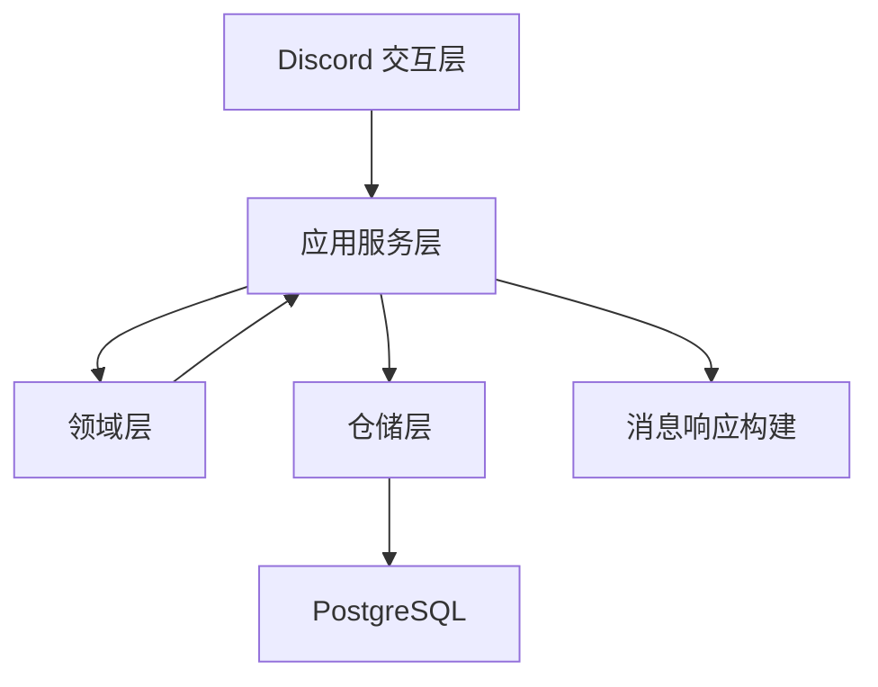

# Discord BOT Python 架构设计文档

## 一、目标与约束

本项目是一个以长期 PVE 刷取为核心，包含异步 PVP、公开战力榜、统一评分系统、战损疗伤、闭关修炼、突破秘境与自动战斗的修仙题材 Discord 文字 BOT。

当前已经明确的玩法边界如下：

- 首发境界开放到渡劫，不进入真仙及以上仙道阶段
- 主循环以无尽副本、装备成长、功法成长、突破推进为核心
- 战斗采用自动结算，不做手操技能释放
- 主修功法决定流派标签与行为模板
- 四部位装备固定为武器、护甲、饰品、法宝
- 装备品质固定为普通、稀有、史诗、传说
- 词条采用天地玄黄四档，不做过细随机浮动
- PVP 为常驻轻量竞争系统，不做重赛季
- 防守快照自动抓取并锁定，不要求玩家手动保存

项目约束如下：

- 高峰同时在线人数约几十人
- 原型落地速度优先
- 原型稳定后仍会继续调整，但不按大规模长期运营系统设计
- 不追求复杂基础设施
- 需要保留合理扩展空间，但不为未来假想规模过度设计

因此总体技术路线应当是：

- 使用 Python 实现
- 使用模块化单体架构
- 使用单进程 BOT 服务
- 使用单个 PostgreSQL 数据库
- 通过数据库事务保证关键状态一致性
- 通过领域模块拆分控制复杂度

## 二、技术选型

### 1. 语言与运行环境

- 语言：Python 3.12
- 依赖管理：uv 或 poetry，二选一即可
- 异步模型：asyncio

选择 Python 的原因：

- 原型阶段开发速度快
- 规则系统表达成本低
- 对几十人同时在线的 Discord BOT，性能足够
- 调整战斗规则、掉落规则、评分规则与自动战斗模板的成本较低

### 2. Discord 框架

推荐：discord.py 2.x

原因：

- 生态成熟
- 对 slash command、button、view、modal 支持完整
- 与 Python 异步模型配合自然
- 社区资料较多，适合快速推进

### 3. 数据库

推荐：PostgreSQL 16+

原因：

- 事务能力稳定
- 排行榜、分页、聚合查询方便
- 支持 JSON 字段，方便保存战报、快照与结算明细
- 后续需要扩展活动、图鉴、更多榜单时不容易受限

### 4. 数据访问

推荐：SQLAlchemy 2.x + Alembic

原因：

- Python 生态成熟
- ORM 与 SQL 表达能力比较平衡
- Alembic 适合维护正式迁移脚本

### 5. 数据校验与配置

- 数据校验：pydantic 2.x
- 配置管理：pydantic-settings

### 6. 日志与测试

- 日志：structlog 或 loguru，二选一即可
- 单元测试：pytest
- 异步测试：pytest-asyncio

## 三、总体架构

整体采用模块化单体架构。

核心原则：

- Discord 交互层不直接承载业务规则
- 战斗、评分、PVP、疗伤、突破、掉落都在领域层实现
- 数据库存取通过仓储层统一进入
- 关键玩家动作使用事务包裹
- 不提前引入 Redis、消息队列、微服务
- 首发围绕自动战斗、稳定成长、资源补口与榜单展示收敛实现范围

整体分层如下：



### 1. 交互层

负责：

- slash command 注册与处理
- button 与 select menu 事件处理
- view 组装
- 输入参数解析
- 基础权限校验
- 响应消息发送
- 角色面板、榜单面板、战报面板展示

这一层不负责：

- 战斗数值计算
- 掉落生成
- 排名变更
- 评分计算
- 事务控制
- 自动战斗行为判断

### 2. 应用服务层

负责组织一次完整玩家行为。

例如：

- 创建角色
- 查看角色面板
- 开始或结束闭关
- 进入无尽副本
- 进行一场副本战斗
- 撤离副本
- 开始疗伤
- 领取疗伤结果
- 发起 PVP 挑战
- 查看排行榜
- 进入突破秘境
- 领取突破资格
- 强化装备
- 洗炼词条
- 参悟功法

这一层负责：

- 读取状态
- 检查业务前置条件
- 开启事务
- 调用领域服务
- 持久化结果
- 组织展示数据

### 3. 领域层

领域层是整个项目的核心。

负责：

- 角色成长规则
- 境界、修为、感悟与突破规则
- 自动战斗规则
- 主修功法行为模板规则
- 敌人生成规则
- 掉落规则
- 装备、强化、词条、法宝规则
- 评分规则
- PVP 挑战与名次变动规则
- 战损与疗伤规则
- 闭关修炼规则
- 突破秘境规则

领域层尽量不直接依赖 Discord API 和 ORM 实体。

### 4. 仓储层

负责：

- 读写玩家角色
- 读写功法、装备、法宝、词条
- 读写副本记录与突破秘境记录
- 读写战报与结算快照
- 读写评分快照与排行榜数据
- 读写闭关状态与疗伤状态
- 读写 PVP 防守快照与挑战记录

仓储层只提供明确的数据访问接口，不承载业务规则。

## 四、目录结构建议

```text
src/
  bot/
    commands/
    views/
    responders/
    interaction_handlers/

  application/
    character/
    cultivation/
    dungeon/
    battle/
    pvp/
    ranking/
    healing/
    breakthrough/
    equipment/
    inventory/

  domain/
    character/
    cultivation/
    battle/
    dungeon/
    breakthrough/
    enemy/
    loot/
    equipment/
    skill/
    pvp/
    ranking/
    healing/
    common/

  infrastructure/
    db/
      models/
      repositories/
      migrations/
    discord/
    config/
    logging/
    scheduler/
    cache/

  tests/
    unit/
    integration/

  main.py
```

目录职责如下：

- `src/bot`：Discord 事件与消息入口
- `src/application`：用例编排
- `src/domain`：核心业务规则
- `src/infrastructure`：数据库、配置、日志、调度等外部依赖
- `src/tests`：测试代码

## 五、核心模块设计

### 1. 角色模块

负责内容：

- 角色基础信息
- 境界与阶段
- 主属性与派生属性
- 当前装备与法宝
- 功法配置
- 天赋配置
- 当前状态快照
- 当前主修功法流派标签

建议拆分的数据对象：

- 角色基础档案
- 角色成长档案
- 角色战斗快照
- 角色评分快照

其中角色战斗快照用于战斗计算，避免战斗模块直接依赖数据库对象。

### 2. 境界与成长模块

负责内容：

- 大境界与小阶段定义
- 标准日修为映射
- 当前修为累计
- 感悟累计
- 突破条件校验
- 突破结果更新

实现上需要明确分开三条线：

- 战斗基础量级曲线
- 修为需求曲线
- 突破条件曲线

不要把三条线绑成一条指数表。

### 3. 闭关修炼模块

负责内容：

- 闭关开始与结束
- 闭关收益结算
- 闭关收益上限
- 闭关与主动收益的组合口径

闭关修炼只产出：

- 修为
- 少量感悟
- 少量灵石

闭关修炼不产出：

- 高品质装备
- 稀有法宝胚子
- 突破资格
- 排行榜核心进度

### 4. 功法模块

负责内容：

- 主修功法
- 护体法门
- 身法秘术
- 神识术法
- 功法升级、参悟、突破
- 主修功法行为模板
- 流派标签生成

必须明确的实现原则：

- 主修功法决定自动战斗行为模板
- 主修功法决定流派标签
- 护体法门、身法秘术、神识术法不改写行为模板主干
- 辅助功法只做数值强化、条件触发与少量阈值修正

首发三条主修功法主轴与六条子方向：

- 剑诀系：问心剑道、斩情剑道
- 炼体系：蛮荒战体、长生道体
- 术法系：青云术脉、忘川术脉

### 5. 战斗模块

战斗模块必须独立且可测试。

建议采用纯规则驱动结构：

- 输入：角色战斗快照、敌人快照、环境规则、随机种子
- 输出：战斗结果、回合日志、战损结果、掉落上下文

战斗模块内部建议拆分：

- 行为模板解析
- 行动顺序
- 技能解析
- 状态效果处理
- 伤害计算
- 战斗结束判定
- 战报生成

行为模板的实现建议：

- 模板只由主修功法决定
- 模板输出目标选择倾向、资源使用倾向、节奏倾向
- 辅助功法只做轻量参数修正

这一模块不直接写数据库。

### 6. 敌人与副本模块

负责内容：

- 无尽副本层数与区域
- 锚点进度
- 敌人生成
- 区域偏置
- 收益结算
- 撤离规则
- 战败规则
- 战损生成入口

首发敌人结构建议固定为三层：

- 模板
- 族群
- 区域偏置

模板收敛为五类：

- 猛攻型
- 坚守型
- 灵巧型
- 术法型
- 恢复型

敌人复杂度建议：

- 普通怪：1 个主动技能加 1 个被动
- 精英怪：2 个主动技能加 1 个被动
- 锚点首领：2 到 3 个主动技能加 2 个被动

### 7. 掉落模块

负责内容：

- 稳定掉落
- 定向掉落
- 高价值随机掉落
- 资源补口掉落
- 底材池控制
- 掉落概率修正

掉落模块建议拆为两个入口：

- 无尽副本主掉落
- 挑战秘境定向资源掉落

无尽副本继续负责：

- 高品质装备
- 稀有法宝胚子
- 异变道纹
- 深层掉落追求

突破秘境重复挑战负责：

- 灵石
- 强化材料
- 洗炼材料
- 功法辅材
- 法宝培养材料

### 8. 装备与法宝模块

负责内容：

- 四部位装备结构
- 底材阶位
- 品质等级
- 强化等级
- 词条与道纹
- 法宝机制
- 祭炼与分解

必须体现以下玩法边界：

- 品质固定为普通、稀有、史诗、传说
- 强化负责稳定成长
- 强化失败只消耗资源，不掉级、不损坏装备
- 词条采用天地玄黄固定档位
- 首发词条以 PVE 与 PVP 通用为主，只保留少量专精词条
- 法宝强化战斗表现，但不改写主修功法行为模板

### 9. 突破秘境模块

负责内容：

- 秘境组配置
- 突破对应关系
- 首通资格发放
- 重复挑战资源配置
- 秘境记录与奖励结算

首发统一做一套突破秘境系统，例如“破境天关”。

系统内部拆成三组：

- 入道三关
- 问心道宫
- 灵墟天关

每个难度统一采用：

- 1 条环境规则
- 1 个守关首领
- 1 次血线阈值变化

### 10. 评分与排行榜模块

负责内容：

- 角色总评分
- 装备评分
- 功法评分
- 法宝评分
- 排行榜查询
- 榜单分页
- 榜单刷新

评分系统需要分为两类：

- 公开评分：用于展示与榜单排序
- 隐藏对战评分：用于 PVP 目标筛选与匹配修正

### 11. PVP 模块

负责内容：

- 防守快照自动抓取
- 快照锁定
- 挑战目标池筛选
- 挑战资格判断
- 异步战斗结算
- 名次变动
- 防刷限制
- 战报记录
- 荣誉币结算

首发 PVP 边界必须体现：

- 轻量常驻竞争，不做重赛季
- 每日有效挑战次数较低，首发建议 5 次
- 防守快照自动抓取，不要求玩家手动保存
- 展示奖励由 BOT 自己绘制，不依赖 Discord 原生头像框与资料卡边框

### 12. 战损与疗伤模块

负责内容：

- 战损状态生成
- 伤势分段
- 疗伤开始
- 疗伤完成判定
- 恢复状态结算

疗伤机制使用结束时间戳，不依赖后台循环逐秒恢复。

实现方式：

- 玩家开始疗伤时，记录开始时间与完成时间
- 玩家下次执行相关操作时，再判断是否已经恢复完成
- 恢复完成则结算状态

## 六、数据库设计原则

数据库不在本阶段写完整表结构，但应先明确原则。

### 1. 核心实体

至少需要以下核心实体：

- 玩家
- 角色
- 角色属性快照
- 功法配置
- 主修功法模板标识
- 装备
- 装备强化记录
- 词条
- 法宝
- 角色库存
- 副本进度
- 突破秘境进度
- 闭关状态
- 疗伤状态
- 战斗记录
- 掉落记录
- PVP 防守快照
- 排行榜快照
- 评分快照
- 荣誉币记录

### 2. 建模原则

- 玩家长期状态与一次性战斗记录分开存储
- 战斗详细日志可以使用 JSON 字段
- 排行榜查询字段要有索引
- PVP 相关状态要能在事务内安全更新
- 快照数据与实时数据分离，避免读取时受状态变化影响
- 自动战斗模板标识应可稳定回放与复算

### 3. 关键索引建议

首发至少为以下字段建立索引：

- 玩家 ID
- 角色 ID
- 角色总评分
- PVP 名次
- 无尽最高层
- 突破秘境记录
- 疗伤完成时间
- 闭关结束时间

## 七、事务边界设计

以下操作必须使用事务：

### 1. 副本战斗结算

需要在一个事务内完成：

- 校验当前副本状态
- 结算战斗
- 更新角色状态
- 写入战损
- 写入掉落
- 更新层数或撤离结果
- 写入战报

### 2. PVP 挑战结算

需要在一个事务内完成：

- 校验挑战资格
- 读取防守快照
- 结算战斗
- 更新名次
- 更新挑战限制状态
- 写入战报
- 结算荣誉币或周结算标记

### 3. 装备强化与词条调整

需要保证：

- 装备本体数据
- 强化等级
- 词条数据
- 消耗材料
- 角色评分刷新标记

这些内容要么一起成功，要么一起失败。

### 4. 突破结算

需要保证：

- 修为与感悟校验
- 突破资格校验
- 突破结果更新
- 境界状态变更
- 新区域解锁标记

一起成功或一起失败。

## 八、缓存与调度策略

当前阶段不建议使用 Redis。

### 1. 适合进程内缓存的内容

- 功法配置
- 词条配置
- 敌人模板
- 副本区域配置
- 突破秘境配置
- 评分权重配置

### 2. 不适合只存内存的内容

- 玩家状态
- 闭关状态
- 疗伤状态
- 排行榜数据
- PVP 挑战次数
- 防守快照
- 突破资格状态

这些必须落库。

### 3. 定时任务策略

首发阶段只保留轻量任务：

- 每隔一段时间刷新榜单快照
- 每隔一段时间清理过期防守快照
- 每隔一段时间清理历史战报归档标记
- 每隔一段时间结算周荣誉奖励或榜单结算标记

疗伤恢复和闭关结算不依赖高频扫描，而依赖玩家下一次访问时按完成时间判定。

## 九、Discord 交互设计原则

这是文字 BOT，交互设计会直接影响体验。

建议原则如下：

- 所有核心功能优先使用 slash command
- 高频操作尽量接 button 和 view，减少重复输入
- 面板消息保持结构稳定，方便玩家快速找到入口
- 战斗结果尽量使用摘要加详情查看，避免消息过长
- 展示类奖励统一落在 BOT 自己生成的面板与榜单里

建议至少有以下主入口：

- 角色面板
- 修炼与闭关
- 无尽副本
- 突破秘境
- 装备与法宝
- 功法配置
- PVP 挑战
- 排行榜
- 疗伤恢复

## 十、性能判断与容量边界

对当前规模，性能压力主要不在 Discord 网关，而在业务实现方式。

真正需要注意的是：

- 一次交互不要触发过多数据库往返
- 战斗结算不要边算边频繁写库
- 排行榜查询不要每次都全量现算
- 战报不要过度拆表，避免查询复杂化
- 快照生成与自动抓取不要做重复写入

对几十人同时游玩的规模，只要遵守以下原则，Python 完全够用：

- 战斗逻辑在内存中一次完成
- 结算阶段集中写库
- 排行榜读快照或走索引查询
- 静态配置走内存缓存

## 十一、测试策略

这个项目的风险不在接口数量，而在数值规则与结算一致性。因此测试重点应当放在领域层。

### 1. 必须写单元测试的模块

- 战斗伤害计算
- 主修功法行为模板选择
- 状态效果叠加
- 控制与抗性判定
- 掉落生成
- 评分计算
- PVP 名次变动
- 疗伤时间分段规则
- 闭关收益结算
- 突破条件判定

### 2. 必须写集成测试的流程

- 玩家创建角色到进入副本
- 副本战斗到结算掉落
- 战败后生成战损并开始疗伤
- 闭关修炼到结算收益
- 突破秘境首通后获得突破资格
- PVP 挑战并更新榜单

## 十二、首发版本实现边界

首发版本只做必要能力：

- 单 BOT 实例
- 单 PostgreSQL 数据库
- 基础角色系统
- 凡人到渡劫的成长主线
- 标准日修为与闭关修炼
- 感悟与突破材料体系
- 三组突破秘境与九次首发突破门槛
- 四部位装备系统
- 四档装备品质
- 强化、洗炼与法宝培养
- 三大主修功法主轴与六条子方向骨架
- 自动战斗结算
- 无尽副本
- 战损与疗伤
- 角色总评分
- 常驻 PVP 挑战榜与总评分榜
- BOT 自绘展示奖励
- 基础战报

首发不做以下内容：

- 真仙及以上仙道内容
- 飞升系统
- 微服务拆分
- Redis 缓存层
- 消息队列
- 复杂活动引擎
- 独立网页后台
- 多实例分片
- 重赛季 PVP
- 套装、镶嵌、复杂打造树
- 复杂首领脚本与重随机词缀系统

## 十三、后续可扩展点

虽然当前不做复杂架构，但应保留以下扩展可能：

- 渡劫到真仙的飞升系统
- 仙界新区域、新资源体系与新副本层级
- 更复杂的流派路线与新主修功法模板
- 更丰富的挑战副本类型
- 装备榜、功法榜、法宝榜等扩展榜单
- 在确有需要时再增加 Redis 作为读取缓存
- 在确有需要时再拆分排行榜刷新任务

## 十四、最终结论

在当前项目阶段，最合适的技术架构是：

- Python 3.12
- discord.py 2.x
- PostgreSQL
- SQLAlchemy 2.x + Alembic
- pydantic 2.x
- asyncio 异步模型
- 模块化单体架构

这套方案的核心优点有三点：

- 实现快，适合原型优先
- 性能足够，能支撑当前规模
- 结构清晰，足够承载当前已经确定的玩法框架

对这个 Discord 修仙文字 BOT，当前最重要的不是把基础设施做重，而是把自动战斗、境界成长、突破秘境、装备成长、PVP 展示、资源补口这些核心系统写清楚、写稳定。
