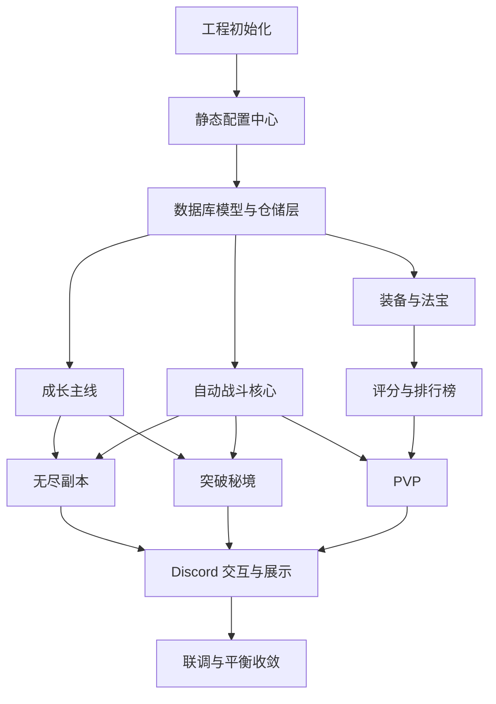

# Discord BOT 首发实施计划

## 一、文档目标

这份文档用于指导首发版本实现顺序、模块边界、联调关系与验收标准。

实现基线以以下两份文档为准：

- `修仙文字BOT全新设计方案.md`
- `plans/DiscordBOT-Python-架构设计文档.md`

首发版本目标明确如下：

- 语言与框架：Python、discord.py、PostgreSQL、SQLAlchemy
- 战斗形式：自动战斗结算
- 境界开放范围：凡人到渡劫
- 主循环：角色成长、无尽副本、装备成长、突破秘境、轻量 PVP、排行榜
- 首发不做：飞升系统、仙道境界、重赛季、复杂首领脚本、套装、镶嵌、复杂打造树、实时 AI 命名链路

## 二、实施总原则

### 1. 先打通主线，再补充表现

优先实现：

- 角色创建
- 修为与闭关
- 自动战斗
- 无尽副本
- 突破秘境
- 装备与强化
- PVP 常驻挑战

后补内容：

- 更完整的战报表现
- 更多展示面板
- 更丰富的日志
- AI 命名覆盖能力

### 2. 先固定规则引擎，再接 Discord 交互

领域层的规则必须先稳定：

- 修为增长
- 境界突破
- 战斗结算
- 掉落记录
- 装备成长
- 排名更新

Discord 指令层只负责展示与触发，不负责定义规则。

### 3. 先做可复算的自动战斗，再做数值调优

战斗必须满足：

- 同样输入可得到同样输出
- 能保存战斗种子或关键上下文
- 能通过日志与快照复盘

### 4. 掉落过程记录，结束结算

实现上必须遵守：

- 每层战斗后只记录运行内资源增量与潜在高价值掉落
- 撤离、战败或阶段结算时统一确认最终保留的掉落
- 高价值掉落展示与命名只在最终结算阶段发生

这样既符合玩法设计，也为后续 AI 命名预留稳定入口。

### 5. AI 命名只预留接口，不进入首发主链路

首发必须预留：

- 命名来源字段
- 命名元数据字段
- 命名服务抽象

首发不做：

- 实时 AI 掉落命名
- 结算同步等待 AI 返回
- 每次掉落都发起外部请求

## 三、首发范围清单

### 必做系统

- 角色创建与基础面板
- 大境界与小阶段成长
- 修为、感悟、突破材料、突破资格
- 闭关修炼
- 自动战斗结算
- 三大主修功法主轴与六条子方向骨架
- 四部位装备系统
- 四档装备品质
- 强化、洗炼、词条档位与档内浮动
- 法宝基础培养
- 无尽副本
- 突破秘境
- 战损与疗伤
- 统一评分系统
- 总评分榜、PVP 挑战榜、无尽深度榜
- 轻量 PVP 挑战
- BOT 自绘展示奖励

### 不做系统

- 真仙及以上仙道阶段
- 飞升系统
- 套装系统
- 镶嵌与宝石系统
- 装备材料转换
- 复杂首领多阶段脚本
- 重随机词缀包系统
- 复杂赛季 PVP
- 原生 Discord 头像框与资料卡边框
- 实时 AI 命名

## 四、关键玩法约束总表

### 1. 境界与成长

- 境界开放到渡劫
- 每个大境界统一为初期、中期、后期、圆满
- 小阶段推进只检查修为与少量稳定材料
- 大境界突破检查修为、感悟、突破材料、突破资格
- 突破固定成功，不做概率失败

### 2. 修为结构

- 标准日修为拆为闭关 35%、主动高效 45%、主动常规 15%、主动低效尾段 5%
- 首发只按凡人到渡劫映射真实修为值
- 闭关只产出修为、少量感悟、少量灵石

### 3. 功法与流派

- 主修功法决定行为模板与流派标签
- 辅助功法不改写行为模板主干
- 三大主轴：剑诀系、炼体系、术法系
- 六条子方向：问心剑道、斩情剑道、蛮荒战体、长生道体、青云术脉、忘川术脉

### 4. 装备与法宝

- 四部位：武器、护甲、饰品、法宝
- 品质：普通、稀有、史诗、传说
- 强化失败不掉级、不损坏
- 词条档位：黄、玄、地、天
- 同档位同词条允许数值浮动
- 少量高阶词条可做 PVE 专精与 PVP 专精

### 5. 副本与掉落

- 无尽副本是主生产内容
- 突破秘境是门槛与定向资源补口内容
- 无尽副本负责高品质装备、法宝胚子、异变道纹
- 突破秘境重复挑战只负责基础资源定向高收益

### 6. PVP

- 常驻轻量竞争结构
- 每日 5 次有效挑战
- 防守快照系统自动抓取并锁定
- 奖励以称号、徽记、BOT 面板边框和少量微调材料为主

## 五、实施阶段

## 阶段 0：工程初始化

### 目标

搭建最小可运行工程骨架。

### 实施项

- 初始化 Python 工程与依赖管理
- 接入 discord.py
- 接入 PostgreSQL、SQLAlchemy、Alembic
- 建立配置、日志、测试骨架
- 建立基础目录结构
- 完成 BOT 启动与基础 slash command 注册

### 产出

- 可启动 BOT 进程
- 可连接数据库
- 可执行基础迁移
- 可运行测试框架

### 验收标准

- 本地可以启动 BOT
- 数据库迁移可以成功执行
- 至少有一个测试用例可以跑通

## 阶段 1：静态配置中心

### 目标

把首发所有基础配置从代码逻辑中抽离。

### 实施项

- 大境界与小阶段配置
- 标准日修为映射配置
- 基础数值基准系数表
- 修为来源占比配置
- 三大主修功法主轴与六条子方向配置
- 装备品质、词条档位、词条池配置
- 敌人模板、族群、区域偏置配置
- 突破秘境组、难度与资源方向配置

### 产出

- 可被领域层读取的配置模块
- 配置校验机制

### 验收标准

- 所有首发规则都能从配置中读出
- 配置缺失或非法时能在启动期报错

## 阶段 2：数据库模型与仓储层

### 目标

把首发数据结构落库。

### 实施项

- 玩家与角色基础表
- 角色成长状态表
- 功法配置表
- 装备、强化、词条、法宝表
- 库存与货币表
- 闭关状态表
- 疗伤状态表
- 无尽副本进度表
- 运行中战利品缓存表或运行状态表
- 突破秘境进度表
- PVP 防守快照表
- 排行榜快照表
- 战报表
- 掉落记录表

### 产出

- 全部迁移脚本
- 对应仓储接口与实现

### 验收标准

- 角色、装备、进度、排行、快照都可完整落库与读取
- 关键实体关系无歧义

## 阶段 3：成长主线

### 目标

打通角色从创建到基础成长的最小闭环。

### 实施项

- 创建角色
- 境界与阶段状态管理
- 修为累计与阶段门槛校验
- 感悟累计
- 闭关修炼开始与结束
- 闭关收益结算
- 突破材料与突破资格校验入口

### 产出

- 角色成长服务
- 闭关服务
- 境界推进服务

### 验收标准

- 新角色可创建
- 可通过修为推进小阶段
- 闭关收益可正确结算
- 突破前置条件可正确判定

## 阶段 4：自动战斗核心

### 目标

建立可复算的自动战斗规则引擎。

### 实施项

- 角色战斗快照生成
- 主修功法行为模板输出
- 辅助功法参数修正
- 行动顺序与回合流程
- 伤害、护盾、恢复、控制、异常、反击处理
- 战斗结果与战报输出
- 战损结果生成

### 产出

- 战斗引擎
- 战报生成器
- 行为模板解析器

### 验收标准

- 同样输入得到同样输出
- 六条子方向行为差异可被战报看出
- 战损可正确生成

## 阶段 5：无尽副本

### 目标

打通主生产玩法。

### 实施项

- 区域与层数结构
- 锚点与起点解锁
- 敌人模板、族群、区域偏置生成
- 普通怪、精英怪、锚点首领战斗接入
- 过程内掉落记录
- 撤离结算
- 战败结算
- 稳定收益与未稳收益处理

### 产出

- 无尽副本运行服务
- 运行状态缓存服务
- 副本结算面板

### 验收标准

- 可正常推进层数
- 可正常撤离与战败
- 掉落只在结算页统一展示与入账

## 阶段 6：装备、强化、词条、法宝

### 目标

建立首发装备成长系统。

### 实施项

- 四部位装备模型
- 四档品质模型
- 强化系统
- 强化成功率与失败只消耗规则
- 词条池与词条档位
- 档位加档内浮动区间生成
- 洗炼与重铸
- 法宝培养
- 装备分解
- 命名服务抽象与模板命名实现

### 产出

- 装备成长服务
- 词条生成服务
- 法宝培养服务
- 命名服务接口

### 验收标准

- 装备可生成
- 强化可消耗灵石和材料并生效
- 同档位词条可出现数值差异
- 高价值掉落命名可通过规则模板生成

## 阶段 7：突破秘境

### 目标

建立突破资格系统与定向资源补口系统。

### 实施项

- 破境天关系统入口
- 入道三关、问心道宫、灵墟天关三组秘境配置
- 九次大境界突破映射
- 首通资格发放
- 重复挑战主资源方向结算
- 前若干次高收益软限制

### 产出

- 突破秘境服务
- 首通与重复挑战奖励服务

### 验收标准

- 首通可获得突破资格
- 重复挑战只产出绑定主资源
- 不会掉核心终局掉落

## 阶段 8：评分与排行榜

### 目标

建立公开评分与榜单查询能力。

### 实施项

- 角色总评分
- 装备评分、功法评分、法宝评分
- 隐藏对战评分
- 总评分榜
- PVP 挑战榜
- 无尽深度榜
- 榜单快照刷新

### 产出

- 评分服务
- 榜单查询服务
- 榜单刷新任务

### 验收标准

- 角色可生成总评分
- 三张首发榜单可正常查询
- 排行刷新不会阻塞主流程

## 阶段 9：PVP

### 目标

建立轻量异步挑战系统。

### 实施项

- 防守快照自动抓取
- 快照锁定周期
- 目标池筛选
- 每日挑战次数
- 防刷规则
- 名次变动规则
- 荣誉币结算
- 展示奖励数据结构

### 产出

- PVP 服务
- 防守快照服务
- 荣誉币服务

### 验收标准

- 可正常发起挑战并结算
- 快照锁定生效
- 每日次数与防刷规则生效
- 排名可稳定更新

## 阶段 10：Discord 交互与展示

### 目标

把核心功能接到 BOT 指令层与展示面板上。

### 实施项

- 角色面板
- 修炼与闭关面板
- 无尽副本入口与结算面板
- 突破秘境入口与结算面板
- 装备、法宝、功法面板
- PVP 挑战与排行榜面板
- 疗伤与恢复面板
- BOT 自绘边框、徽记、称号展示

### 产出

- 首发交互闭环
- 展示面板组件

### 验收标准

- 主要系统均有 Discord 入口
- 掉落、排行、称号、边框都能在 BOT 面板中展示

## 阶段 11：联调与平衡收敛

### 目标

修正主链路问题并完成首发可玩性收敛。

### 实施项

- 修为收益联调
- 境界门槛联调
- 无尽副本收益联调
- 突破秘境门槛联调
- 强化、洗炼、词条产出联调
- PVP 次数、防刷、奖励联调
- 战报与面板文案收敛

### 产出

- 首发平衡配置
- 首发交互稳定版

### 验收标准

- 从凡人到至少中高境界的主链路可连续推进
- 装备成长、突破、PVP 三条副线不会互相打架
- 首发无明显死循环与资源断口

### 阶段 11 已确认联调口径（持续更新）

#### 1. 修为收益联调

- `standard_days` 只作为成长周期与节奏标尺，不进入运行时单次收益结算
- `daily_cultivation` 继续作为 1 个标准日修为值
- 闭关修为来源占比保持 35%，不按境界拆分
- 闭关感悟暂不改模型，阶段 11 通过“境界门槛联调”重做九次大境界突破的感悟需求值
- 高境界灵石数量允许显著增长，不主动压缩数量级
- 灵石联调只维护一条主曲线，按角色当前境界对应的 `realm_curve.coefficient` 推导经济倍率
- 首轮联调起始公式：`economy_multiplier = max(1, round(realm_coefficient ^ 0.28))`
- 灵石主曲线同时作用于来源与消耗，保证高境界灵石供需同步放大
- 先只放大 `spirit_stone`，不同时放大强化石、洗炼材料、重铸晶、法宝精华等其他材料
- 当前确认的灵石主曲线接入范围：
  - 闭关灵石产出
  - 突破秘境灵石奖励
  - 强化的灵石消耗
  - 洗炼的灵石消耗
  - 重铸的灵石消耗
  - 法宝培养的灵石消耗
- 装备、法宝阶数系统已实现，本轮灵石联调直接复用现有阶数映射与境界信息，不另起一套经济阶数系统

#### 2. 境界门槛联调

- 小阶段比例暂不调整，继续保持当前配置与自动推导结果
- 小阶段推进规则暂不补入稳定材料门槛，第 11 阶段继续只校验修为推进
- 大境界突破继续保持四项门槛：修为圆满、感悟达标、突破资格达成、突破材料足够
- 感悟门槛改为接入境界基准系数，不再继续手填离散增长值作为长期方案
- 感悟门槛与无尽副本稳定感悟改为共用同一增长曲线，后期量级保持一致
- `realm_coefficient` 在本轮用于放大副本收益与感悟门槛，不替换 `standard_days`、`daily_cultivation`、`total_cultivation` 的主线基准逻辑
- 在正式破境执行链路补齐前，当前感悟门槛仍按累计阈值理解与联调
- 当前无尽副本稳定感悟仍作为主来源，闭关感悟仍作为补充来源

#### 3. 无尽副本收益联调

- 无尽副本稳定修为和稳定感悟改为接入 `realm_coefficient`，用于修正后期固定绝对值收益失真问题
- 接入境界系数用于放大副本收益与基础数值，不替换 `standard_days`、`daily_cultivation`、`total_cultivation` 主线基准逻辑
- 当前普通层、精英层、锚点首领的修为与感悟配置值改按节点权重理解，保留节点相对差异
- 完整区域稳定感悟目标控制为当前境界突破感悟门槛的十分之一或更少
- 完整区域稳定修为按主动高效段联调，首轮口径为：至少 5 个完整区域，才能达到无尽副本对应 1 天主动高效段修为
- 对应首轮整区修为目标：`region_total_cultivation = daily_cultivation × 0.45 / 5`
- 材料、炼华精粹、装备分、法宝分、道纹分本轮不动
- 战败未稳收益保留比例改为 `0`，战败仅保留稳定收益

#### 4. 突破秘境门槛联调

- 突破秘境挑战入口继续只按 `current_realm_id` 开放当前首通关卡，不额外把修为圆满、感悟达标、材料齐全前置到挑战入口
- 已首通关卡继续允许重复挑战，保持其作为基础资源补口入口的定位
- 当前突破秘境仍主要负责首通资格验证、首通记录与重复资源补口，在正式破境执行链路补齐前，不承担直接切换角色大境界的职责
- 首通战斗门槛本轮重点联调 `boss_scale_permille`，按三组抬升口径处理：入道三关 `1000 / 1080 / 1180`，问心道宫 `1300 / 1450 / 1620`，灵墟天关 `1820 / 2050 / 2320`
- `environment_rules` 中的平面整数修正不再作为长期主方案，`max_hp`、`attack_power`、`guard_power`、`speed` 等平面修正改为相对倍率型修正
- `permille` 类固定修正可继续保留，用于维持环境风格差异与机制辨识度
- 本轮只联调突破秘境的门槛与战斗压力，不改首通奖励结构与重复奖励边界

#### 5. PVP 次数、防刷、奖励联调

- 每日有效挑战次数上限调整为 `6`
- 同一目标当日重复挑战上限调整为 `3`
- 防守快照锁定规则本轮保持现状，不额外增加复杂度；相同构筑在锁定期内复用，构筑变化仍允许刷新新快照
- 高名次防守失败上限放宽为：前 `3` 名每日最多记录 `3` 次，前 `10` 名每日最多记录 `5` 次
- 荣誉币胜利基础值保持 `18`
- 荣誉币失败基础值收敛为 `2`，后续实现需同步修正当前 `loss_base`、`loss_floor` 与失败结算结果不一致的问题
- 挑战更低名次目标时，胜利只获得基础胜利荣誉币的四分之一，向下取整，且不叠加名次差加成、爆冷加成、连胜加成
- 以上一条按当前胜利基础值计算，打更低名次目标时胜利固定获得 `4` 荣誉币
- 目标池筛选窗口、境界差限制、公开评分与隐藏评分容差、本轮不调整

#### 6. 战报与面板文案收敛

- 本轮只统一玩家可见的面板标题、字段标题、按钮文案、公开播报与词条命名风格；系统提示、内部报错、日志、配置键、数据库字段与代码标识不纳入统一范围
- 玩家展示层不再暴露内部标识，例如 `mapping_id`、`environment_rule_id`、`template_id`、`behavior_template_id`、`patch` 等内部字段
- 无尽副本统一改称 **无涯渊境**；相关展示统一使用“无涯渊境入口”“无涯渊境结算”“本轮渊行”“渊境榜”等表述
- 总评分榜统一改称 **天榜**
- PVP 挑战榜统一改称 **仙榜**；PVP 玩法展示统一改称 **仙榜论道**；相关面板、按钮、结算中的“斗法”统一改为“论道”
- 功法相关展示统一术语：`主轴` 改为 **主修体系**，`行为模板` 改为 **战斗流派**，`补丁` 改为 **流派加成**，`模板补丁` 改为 **流派修正**
- 装备相关展示统一术语：装备 `模板` 改为 **底材**，法宝 `模板` 改为 **法宝器胚**
- 无尽副本展示统一术语：`稳定收益 / 待确认收益 / 待确认掉落` 收敛为 **稳定收益 / 未稳收益 / 未稳掉落**，不再向玩家显示 `run` 这类内部英文词
- PVP 面板中的“段位”统一改为 **奖励档位**，避免与当前实际榜位奖励结构混淆
- 突破秘境历史状态统一按真实进度显示为 **无记录 / 未通关 / 已通关**，不再用是否首通粗判
- 所有玩家面板统一使用中文资源名，补齐当前配置对应的资源映射，避免直接显示 `item_id` 等内部标识
- 词条命名风格统一为**修仙风格**，不再采用过于直白的简短名词口径；首轮统一映射示例为：**杀伐 / 破罡 / 命元 / 护元 / 御伤 / 会心 / 身法 / 灵障**
- 场景专精词条命名同步收敛为修仙世界观口径，统一按“玩法前缀 + 修仙词条名”呈现，例如 **渊境·杀伐 / 渊境·会心 / 仙榜·护元 / 仙榜·御伤**，不再混用“PVE / PVP 专精”与工程化缩写

## 六、模块依赖顺序

## 七、首发数据与规则优先实现项

为了减少返工，以下内容应在实现早期就固定为配置项：

- 大境界与小阶段表
- 标准日修为映射表
- 修为来源占比表
- 三大主修功法主轴与六条子方向定义
- 四部位与四档品质定义
- 词条档位与浮动规则定义
- 三组突破秘境与九个突破映射关系
- PVP 次数、快照锁定时长、防刷规则

## 八、AI 命名预留方案

首发只做预留，不做实时外部调用。

必须预留的数据：

- 命名来源字段
- 命名种子或命名输入摘要
- 流派标签
- 掉落场景标签
- 品质、词条、法宝机制摘要

后续接 AI 时，推荐方式如下：

- 只对最终结算后保留的高价值掉落命名
- 只覆盖高品质装备、稀有法宝、特殊功法
- 通过异步任务补全名字，不阻塞主结算链路

## 九、实施完成判定

当以下条件全部满足时，可以视为首发实施计划完成：

- 从角色创建到渡劫前终局内容的主线可完整跑通
- 自动战斗、无尽副本、突破秘境、PVP 均可独立运行
- 装备、强化、词条、法宝成长系统可稳定驱动长期刷取
- 排行榜、称号、BOT 自绘展示奖励可正常工作
- 文档设计与实现边界一致，没有明显超范围功能混入

## 十、最终结论

这份实施计划的核心策略是：

- 先打通成长主线
- 再打通战斗与副本
- 再补装备成长与突破门槛
- 最后接入 PVP、榜单与展示

整个首发版本的实现重点，不是把系统做得很宽，而是把“自动战斗、成长推进、资源补口、挑战验证、轻量竞争”这五条线做成一个稳定闭环。
