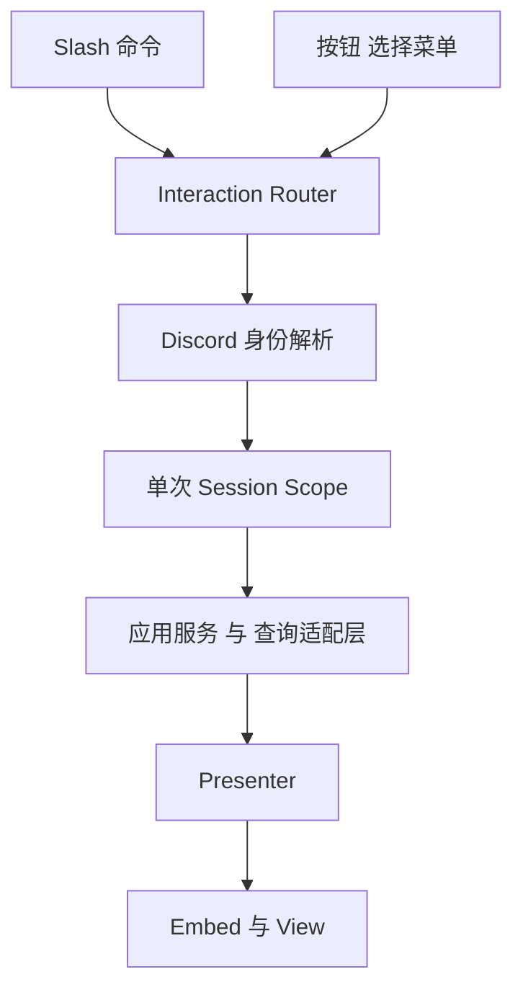
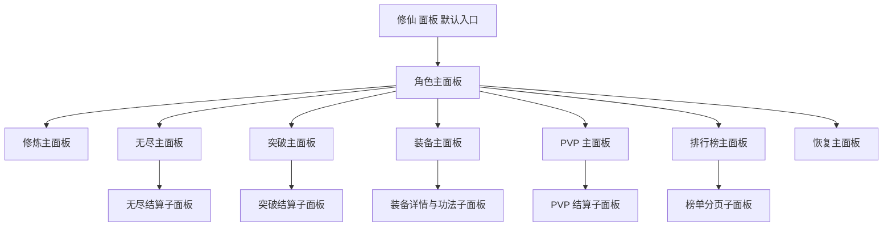

# 阶段 10 Discord 交互与展示设计

## 1. 范围与基线

本文只覆盖阶段 10 的 Discord 交互与展示设计，不进入实现，不处理阶段 11，也不回头修改阶段 0 到阶段 9 的规则、数据结构与既有设计结论。

设计基线：

- [plans/DiscordBOT-首发实施计划.md](plans/DiscordBOT-首发实施计划.md)
- [plans/DiscordBOT-Python-架构设计文档.md](plans/DiscordBOT-Python-架构设计文档.md)
- 必要补充参考：[plans/修仙文字BOT全新设计方案.md](plans/修仙文字BOT全新设计方案.md)
- 现有 Discord 接入与启动链路：[src/bot/bootstrap.py](src/bot/bootstrap.py)、[src/infrastructure/discord/client.py](src/infrastructure/discord/client.py)
- 阶段 10 直接依赖的现有应用服务目录：[src/application/character](src/application/character)、[src/application/dungeon](src/application/dungeon)、[src/application/breakthrough](src/application/breakthrough)、[src/application/equipment](src/application/equipment)、[src/application/pvp](src/application/pvp)、[src/application/ranking](src/application/ranking)

### 1.1 用户优先约束

在基线文档中，阶段 10 原始描述包含 BOT 自绘边框、徽记、称号展示；但本次设计采用最新用户约束：

- **完全移除边框相关设计**
- **只保留徽记与称号展示**
- 在实现阶段不制作新的边框或头像框资源

因此，本文中所有展示奖励只保留：

- 角色自带称号
- PVP 派生称号
- PVP 派生徽记

而 [src/domain/pvp/models.py](src/domain/pvp/models.py:19) 与 [src/domain/pvp/rules.py](src/domain/pvp/rules.py:39) 中仍然存在的 `panel_frame` 与 `avatar_frame` 奖励类型，在阶段 10 的展示层中应被**显式过滤，不进入面板渲染**。

## 2. 当前代码基础与阶段 10 关键缺口

### 2.1 已有可复用能力

| 维度 | 现有位置 | 已有能力 | 阶段 10 复用方式 |
| --- | --- | --- | --- |
| Discord 客户端骨架 | [src/infrastructure/discord/client.py](src/infrastructure/discord/client.py) | 当前仅注册 [`ping`](src/infrastructure/discord/client.py:59) 命令，具备命令树与同步机制 | 扩展为阶段 10 命令注册、按钮与选择菜单分发入口 |
| 启动编排 | [src/bot/bootstrap.py](src/bot/bootstrap.py) | 当前能构造数据库、榜单刷新协调器与最小客户端 | 扩展为阶段 10 应用服务装配与交互依赖注入 |
| 角色成长读取 | [`CharacterGrowthService.get_snapshot()`](src/application/character/growth_service.py:149) | 返回角色名、称号、境界、修为、货币等基础快照 | 角色总览、修炼面板、恢复面板基础数据 |
| 大境界突破预检 | [`CharacterProgressionService.get_breakthrough_precheck()`](src/application/character/progression_service.py:77) | 返回目标境界、修为缺口、感悟缺口、资格缺口、材料缺口 | 角色总览与突破入口提示 |
| 闭关流程 | [`RetreatService.start_retreat()`](src/application/character/retreat_service.py:108)、[`RetreatService.get_retreat_status()`](src/application/character/retreat_service.py:145)、[`RetreatService.settle_retreat()`](src/application/character/retreat_service.py:180) | 闭关开始、状态读取、收益结算完整可用 | 修炼与闭关面板主链路 |
| 无尽副本流程 | [`EndlessDungeonService.start_run()`](src/application/dungeon/endless_service.py:402)、[`EndlessDungeonService.advance_next_floor()`](src/application/dungeon/endless_service.py:492)、[`EndlessDungeonService.settle_retreat()`](src/application/dungeon/endless_service.py:647)、[`EndlessDungeonService.settle_defeat()`](src/application/dungeon/endless_service.py:672)、[`EndlessDungeonService.get_settlement_result()`](src/application/dungeon/endless_service.py:697)、[`EndlessDungeonService.get_current_run_state()`](src/application/dungeon/endless_service.py:707) | 运行态、推进、撤离、战败结算、最近结算读取均已具备 | 无尽副本入口、运行面板、结算面板 |
| 突破秘境流程 | [`BreakthroughTrialService.get_trial_hub()`](src/application/breakthrough/trial_service.py:192)、[`BreakthroughTrialService.challenge_trial()`](src/application/breakthrough/trial_service.py:251) | 入口分组、当前关卡、重复挑战、挑战结算已串联 [`BreakthroughRewardService`](src/application/breakthrough/reward_service.py:77) | 突破秘境入口、挑战与结算面板 |
| 装备与法宝流程 | [`EquipmentService.list_equipment()`](src/application/equipment/equipment_service.py:487)、[`EquipmentService.get_equipment_detail()`](src/application/equipment/equipment_service.py:482)、[`EquipmentService.enhance_equipment()`](src/application/equipment/equipment_service.py:305)、[`EquipmentService.wash_equipment()`](src/application/equipment/equipment_service.py:348)、[`EquipmentService.reforge_equipment()`](src/application/equipment/equipment_service.py:383)、[`EquipmentService.nurture_artifact()`](src/application/equipment/equipment_service.py:416)、[`EquipmentService.dismantle_equipment()`](src/application/equipment/equipment_service.py:443) | 已支持展示与核心操作 | 装备总览、单件详情、法宝培养、资源变动反馈 |
| PVP 主链路 | [`PvpService.get_pvp_hub()`](src/application/pvp/pvp_service.py:188)、[`PvpService.list_targets()`](src/application/pvp/pvp_service.py:261)、[`PvpService.challenge_target()`](src/application/pvp/pvp_service.py:309) | 目标池、挑战、名次变动、荣誉币结算、奖励展示结构完整 | PVP 入口、目标选择、挑战结算面板 |
| 榜单查询 | [`LeaderboardQueryService.query_leaderboard()`](src/application/ranking/leaderboard_query_service.py:58) | 已能查询总评分榜、PVP 榜、无尽深度榜 | 排行榜面板分页与切榜 |
| 评分与功法画像 | [`CharacterScoreService.refresh_character_score()`](src/application/ranking/score_service.py:79) | 可产出主修流派、偏好场景、评分拆分 | 角色总览、功法展示页、PVP 摘要 |
| PVP 防守摘要 | [`PvpDefenseSnapshotService.build_display_summary()`](src/application/pvp/defense_snapshot_service.py:200) | 已能生成可直接展示的防守摘要 | PVP 主界面防守卡片 |

### 2.2 阶段 10 必须承认的缺口

1. [src/infrastructure/discord/client.py](src/infrastructure/discord/client.py) 当前只有 `ping`，没有阶段 10 任何命令组、按钮回调或 View 生命周期管理。
2. [src/bot/bootstrap.py](src/bot/bootstrap.py) 当前的 `ApplicationServiceBundle` 仅包含阶段 9 相关服务，不足以支撑角色、闭关、无尽、突破、装备、榜单、恢复等入口。
3. 现有应用服务大多以 `character_id` 为输入，但 Discord 交互天然拿到的是 `discord_user_id`，因此阶段 10 需要补一层**Discord 身份解析**。
4. 当前没有独立的“角色总览聚合查询服务”，角色面板需要把成长、突破预检、装备概览、评分、PVP 摘要拼接起来；该聚合应当通过新增查询适配层完成，不能让 Discord 层直接拼仓储。
5. 当前没有独立的“疗伤应用服务”。只有 [HealingState](src/infrastructure/db/models.py:518) 模型与 [`StateRepository.get_healing_state()`](src/infrastructure/db/repositories.py:244) 仓储接口，因此阶段 10 的“疗伤与恢复”入口应设计为**恢复状态面板**，并要求实现阶段补一个只读查询适配层，而不是在 Discord 层直连仓储。
6. 当前 [EquipmentService](src/application/equipment/equipment_service.py:252) **没有 equip 或 unequip 操作**，因此阶段 10 的装备页以“展示、强化、洗炼、重铸、培养、分解”为主，不设计装备位切换逻辑。
7. 当前工程有 [CharacterSkillLoadout](src/infrastructure/db/models.py:218) 数据结构，但没有“切换功法配置”的应用服务，因此功法页在阶段 10 中应定位为**展示页**，不新增切换规则。
8. 当前 PVP 奖励展示结构仍可能产出 frame 类型奖励，阶段 10 presenter 必须过滤。

## 3. 阶段 10 交互架构结论

### 3.1 交互分层

阶段 10 保持基线文档的分层约束：

- Discord 层只负责命令注册、按钮路由、参数解析、消息编辑与错误映射
- 业务行为继续由现有应用服务负责
- 新增的查询适配层只做聚合与投影，不重写领域规则
- 单次交互使用单次数据库会话，不在持久 View 中长持有 SQLAlchemy session

### 3.2 面板优先的总体交互原则

阶段 10 按最新约束，采用**面板优先**而不是**指令优先**：

- `/修仙 面板` 作为已创建角色用户的**默认入口**，角色主面板是全部首发系统的统一导航枢纽
- 首发推荐优先使用**中文 slash command**；命令仍保留**快捷直达**、**异常兜底**与**新手引导**职责，不应让用户长期依赖纯指令完成日常循环
- 修炼、无尽、突破、装备、PVP、排行榜、恢复都应提供按钮或选择菜单入口，允许多个面板协同，但要保持统一返回链路
- 高频状态查询、参数选择、确认与结算复看，优先在原面板消息内完成，通过**编辑原消息**而非连续发送新消息推进流程
- 只有具备社交传播价值的结果才考虑公开发送，其余控制类与资源类反馈默认仅对操作者自己可见

### 3.3 阶段 10 首发最终定稿方案

本阶段不再把所有 slash command 视为同等入口，而是明确以下**最终定稿**：

| 层级 | 最终定稿 | 实现约束 |
| --- | --- | --- |
| 默认入口 | `/修仙 面板` 打开角色主面板 | 角色主面板是唯一公开 Home，负责频道展示与导流，公开消息限时回收 |
| 主面板 | 角色、修炼、无尽、突破、装备、PVP、排行榜、恢复 | 只有角色主面板默认公开，其余主面板默认私有 |
| 子面板 | 无尽结算、突破结算、装备详情、功法页、PVP 结算、榜单分页 | 子面板承载具体操作、过程反馈与完整结算，不在公开主面板内展开 |
| 指令角色 | `/修仙 创建` 为前置创建入口，其余中文 slash command 为快捷入口 | 快捷命令复用同一套面板与路由，不再各自维护独立交互闭环 |
| 可见性边界 | 公开角色主面板 + 无尽、突破、PVP 高光结算 + 榜单分享 | 所有实际操作、目标选择、完整资源账本与完整结算默认仅自己可见 |

### 3.4 消息可见性策略与公开 私有矩阵

为减少频道刷屏，阶段 10 的最终定稿为**公开角色主面板 + 私有操作子面板 + 公开高光结算与榜单分享**。默认规则如下：

- 角色主面板允许公开显示，承担频道内角色快照、头像展示与统一导流职责，但必须带**长超时自动回收**
- 会改变个人状态、资源、库存、目标选择、进度缺口与完整账本的交互，一律优先私有
- 无尽、突破、PVP 只公开高光结算；公开版只展示高价值掉落、资格变化、名次变化、纪录刷新与关键资源摘要
- 排行榜允许手动分享公开摘要，但浏览、翻页与筛选过程默认私有
- 公开消息不承载完整操作日志、全量资源账本、库存明细、目标池明细与个人缺口数据
- 公开角色主面板限制为**仅操作者可交互、其他用户可查看**，避免频道内他人误触发操作
- 设计依据：公开主面板负责展示感与导流，私有子面板负责高频操作与完整账本，兼顾频道存在感与防刷屏

| 场景 | 默认可见性 | 允许公开的最终边界 | 设计依据 |
| --- | --- | --- | --- |
| 角色主面板 | **公开显示 限时回收** | 默认公开展示头像、身份、详细属性与导航入口 | 提供频道展示与导流，但不在公开面板内执行实际操作 |
| 修炼与闭关 | 仅自己可见 | 不公开 | 高频状态读取与收益结算社交价值低，且容易刷屏 |
| 无尽副本入口与运行 | 仅自己可见 | 不公开 | 起点选择、推进、撤离都属于高频控制交互 |
| 无尽副本结算 | **私有详细结算 + 公开高光结算** | 公开最终掉落亮点、关键资源摘要、最佳纪录刷新 | 兼顾掉落展示感与详细账本私密性 |
| 突破秘境入口 | 仅自己可见 | 不公开 | 资格缺口与材料缺口高度个人化 |
| 突破秘境结算 | **私有详细结算 + 公开高光结算** | 公开首通资格、关键掉落与资源摘要 | 首通成就适合展示，但完整明细应收敛到私有 |
| 装备与功法 | 仅自己可见 | 不公开 | 养成比较、材料消耗、词条明细属于个人决策信息 |
| PVP 挑战 | 目标池、操作面板与详细结算仅自己可见 | 公开名次变化、展示奖励摘要与关键胜场结果 | 保留竞技感，但不暴露目标池、拒绝原因与反滥用细节 |
| 排行榜 | 默认仅自己可见浏览 | 手动分享当前榜单摘要时公开 | 适合围观，但翻页过程不应刷屏 |
| 疗伤与恢复 | 仅自己可见 | 不公开 | HP MP 与疗伤倒计时属于个人状态信息 |

**公开角色主面板生命周期建议**

- 推荐使用较长空闲超时，首发建议 20 到 30 分钟
- 采用最简单实现：基于 `View.timeout` 作为空闲计时器，每次操作者点击后返回新的 View，等价于重置空闲计时
- 空闲超时后优先删除公开消息；若删除失败或权限不足，则退化为移除 View 并保留一条已过期提示
- 阶段 10 不强制做同频道去重或唯一面板复用，每次打开的公开主面板独立计时并独立回收

### 3.5 为兼顾展示感与防刷屏而采用的交互闭环

1. 用户通过 `/修仙 面板` 或快捷命令进入**公开角色主面板**。
2. 公开角色主面板展示 Discord 头像、身份信息、详细属性与跨系统摘要，承担频道展示与导流职责。
3. 从公开角色主面板点击系统按钮时，统一拉起对应**私有子面板**继续操作，而不是把公开消息直接改成资源与结算详情页。
4. 私有子面板内部的跳转、刷新、确认与结算，优先编辑同一条私有面板消息，不额外连发新消息。
5. 结算类结果先给出**私有完整摘要**，包括资源变化、掉落、资格变化、属性变化与完整账本。
6. 无尽、突破、PVP 最终结算完成后，默认再发送一条**公开高光结算播报**到频道，突出高价值掉落、资格变化、名次变化与纪录刷新。
7. 榜单默认在私有面板浏览，只有用户明确触发分享时才发送**公开榜单摘要**。
8. 修炼闭关、装备养成、恢复状态等低社交价值或高频反馈保持私有，避免频道被低价值信息刷屏。
9. 公开角色主面板在长时间无交互后自动回收，避免频道长期残留失效入口。

### 3.6 统一导航原则

所有主面板都保持同一套导航规则：

- 角色主面板作为 Home，并允许公开展示
- 从公开角色主面板进入操作时，默认切到私有子面板链路
- 子面板提供返回上一面板
- 主面板与子面板都支持刷新当前面板
- 主面板允许跳转相邻主系统
- 公开结算播报只承担展示职责，不作为继续操作的主入口
- 结算子面板在满足条件时可以追加公开播报按钮，但默认方案建议无尽、突破、PVP 最终结算直接公开播报

这样既能满足“主要系统均有 Discord 入口”，又能确保首发交互以面板闭环而不是命令闭环为主，同时把公开消息收敛在可控范围内。

## 4. Discord 指令与面板入口清单

### 4.1 默认入口组织

- 已创建角色用户的推荐默认入口是 `/修仙 面板`
- 首发文案与 slash command 推荐统一使用中文命名，方便玩家理解；如实现阶段需要保留英文字母兼容别名，只作为调试或兼容入口
- `/修仙 面板` 推荐在频道中打开**限时公开的角色主面板**，作为详细属性展示与统一入口
- `/修仙 创建` 只负责创建角色与首次引导
- 其余命令保留为快捷直达与异常兜底，不承担首发主闭环的主要组织职责
- 从公开角色主面板进入操作链路后，可切换到私有子面板继续交互，避免把操作细节暴露到频道

| 指令 | 作用 | 对应主面板 | 首发定位 |
| --- | --- | --- | --- |
| `/修仙 面板` | 打开角色总览与全局导航 | 角色面板 | **默认主入口，推荐公开显示并自动回收** |
| `/修仙 创建` | 创建角色 | 新手引导面板 | 前置创建入口 |
| `/修仙 修炼` | 快捷打开修炼与闭关面板 | 修炼面板 | 快捷直达 |
| `/修仙 无尽` | 快捷打开无尽副本面板 | 无尽面板 | 快捷直达 |
| `/修仙 突破` | 快捷打开突破秘境面板 | 突破面板 | 快捷直达 |
| `/修仙 装备` | 快捷打开装备与法宝面板 | 装备面板 | 快捷直达 |
| `/修仙 斗法` | 快捷打开 PVP 面板 | PVP 面板 | 快捷直达 |
| `/修仙 榜单` | 快捷打开排行榜面板 | 排行榜面板 | 快捷直达 |
| `/修仙 恢复` | 快捷打开恢复状态面板 | 恢复面板 | 快捷直达 |

### 4.2 主面板与子面板关系

| 主面板 | 核心子面板或子状态 | 关系说明 |
| --- | --- | --- |
| 角色面板 | 无 | Home 与统一导航枢纽 |
| 修炼面板 | 未闭关态、闭关中态、闭关结算态 | 状态切换仍留在修炼主面板内 |
| 无尽面板 | 入口态、运行态、最近结算态 | 结算属于无尽主面板的子状态 |
| 突破面板 | 预检 hub、挑战结果态 | 结果态结束后回到突破主面板 |
| 装备面板 | 单件详情页、功法只读页 | 详情页是装备主面板的子页 |
| PVP 面板 | 目标池态、挑战结算态 | 排行榜是可跳转的独立主面板 |
| 排行榜面板 | 三榜切换态、分页态 | 仍视为单一主面板 |
| 恢复面板 | 状态详情态 | 只读主面板，可回跳其他系统 |

### 4.3 面板内二级入口建议

| 面板 | 二级入口 | 类型 | 作用 |
| --- | --- | --- | --- |
| 角色面板 | 刷新总览 | Button | 只重跑公开角色主面板查询，不改动业务状态 |
| 角色面板 | 修炼 | Button | 跳转修炼面板 |
| 角色面板 | 无尽副本 | Button | 跳转无尽面板 |
| 角色面板 | 突破秘境 | Button | 跳转突破面板 |
| 角色面板 | 装备法宝功法 | Button | 跳转装备面板 |
| 角色面板 | PVP | Button | 跳转 PVP 面板 |
| 角色面板 | 排行榜 | Button | 跳转排行榜面板 |
| 角色面板 | 恢复状态 | Button | 跳转恢复面板 |
| 修炼面板 | 闭关时长 | Select | 12h 24h 48h 等固定选项 |
| 修炼面板 | 开始闭关 | Button | 调用闭关开始 |
| 修炼面板 | 结算闭关 | Button | 调用闭关结算 |
| 无尽面板 | 起始层选择 | Select | 只展示已解锁起始层 |
| 无尽面板 | 开始运行 | Button | 开启新 run |
| 无尽面板 | 推进一层 | Button | 调用单层推进 |
| 无尽面板 | 主动撤离 | Button | 调用撤离结算 |
| 无尽面板 | 战败结算 | Button | 当状态为待战败结算时显示 |
| 无尽面板 | 查看最近结算 | Button | 复看最近结算结果 |
| 无尽面板 | 公开战绩摘要 | Button | 仅在满足公开条件时发送精简战绩卡 |
| 突破面板 | 关卡选择 | Select | 当前关卡或已通关可重复关卡 |
| 突破面板 | 发起挑战 | Button | 调用挑战 |
| 突破面板 | 查看当前资格 | Button | 刷新当前资格与前置条件 |
| 突破面板 | 公开资格达成摘要 | Button | 仅在首通资格达成时可选公开 |
| 装备面板 | 装备列表 | Select | 打开单件详情 |
| 装备面板 | 强化 | Button | 对单件装备执行强化 |
| 装备面板 | 洗炼锁定 | Multi Select | 选择保留词条位置 |
| 装备面板 | 洗炼 | Button | 执行洗炼 |
| 装备面板 | 重铸 | Button | 执行重铸 |
| 装备面板 | 法宝培养 | Button | 对法宝执行培养 |
| 装备面板 | 分解确认 | Button | 执行分解 |
| 装备面板 | 功法页签 | Button | 切到功法展示页 |
| PVP 面板 | 刷新目标池 | Button | 重新读取目标池 |
| PVP 面板 | 目标选择 | Select | 选择挑战对象 |
| PVP 面板 | 发起挑战 | Button | 执行挑战 |
| PVP 面板 | 公开挑战摘要 | Button | 发送公开名次变化摘要，不公开完整目标池 |
| 排行榜面板 | 总评分榜 | Button | 切榜 |
| 排行榜面板 | PVP 榜 | Button | 切榜 |
| 排行榜面板 | 无尽深度榜 | Button | 切榜 |
| 排行榜面板 | 上一页 下一页 | Button | 翻页 |
| 排行榜面板 | 分享当前榜单 | Button | 发送公开榜单摘要 |
| 恢复面板 | 刷新状态 | Button | 重载恢复快照 |
| 恢复面板 | 返回无尽 | Button | 回到无尽面板 |
| 恢复面板 | 返回突破 | Button | 回到突破面板 |
| 恢复面板 | 返回角色 | Button | 回到角色总览 |

## 5. 各入口的服务映射、查询数据、交互流程与组件结构

## 5.1 角色面板

### 5.1.1 直接复用的现有应用服务

- [`CharacterGrowthService.get_snapshot()`](src/application/character/growth_service.py:149)
- [`CharacterProgressionService.get_breakthrough_precheck()`](src/application/character/progression_service.py:77)
- [`EquipmentService.list_equipment()`](src/application/equipment/equipment_service.py:487)
- [`PvpService.get_pvp_hub()`](src/application/pvp/pvp_service.py:188)
- 评分信息优先读取现有缓存，若缺失则调用 [`CharacterScoreService.refresh_character_score()`](src/application/ranking/score_service.py:79)

### 5.1.2 所需查询数据

角色主面板的属性口径应尽量对齐 [`BattleUnitSnapshot`](src/domain/battle/models.py:115) 可稳定投影的字段集合，避免面板显示值与实际战斗值长期分叉。阶段 10 首发要求把角色主面板固定拆成**头像区、身份区、主展示属性区、扩展属性区、操作入口区**，其中属性字段必须再细分为**主展示字段**与**扩展字段**，边界如下：

- 头像区：
  - Discord 头像 URL
- 身份区：
  - Discord 显示名
  - 玩家显示名
  - 角色名
  - 当前称号
  - 当前可见徽记与 PVP 派生称号
  - 当前大境界 小阶段
  - 主修流派 偏好场景
  - 公开评分 隐藏对战评分
  - 修为 感悟 灵石 荣誉币
  - 突破资格状态
  - 下一阶段门槛
- 主展示属性字段：
  - `current_hp` `max_hp` `hp_ratio_permille`
  - `current_resource` `max_resource` `resource_ratio_permille`
  - `attack_power`
  - `guard_power`
  - `speed`
  - `hit_rate_permille`
  - `dodge_rate_permille`
  - `crit_rate_permille`
  - `crit_damage_bonus_permille`
- 扩展属性字段：
  - 若可稳定聚合，则补充当前护盾或等效护体值
  - `damage_bonus_permille`
  - `damage_reduction_permille`
  - `counter_rate_permille`
  - `control_bonus_permille`
  - `control_resist_permille`
  - `healing_power_permille`
  - `shield_power_permille`
- 操作入口区附带系统摘要：
  - 已装备件数
  - 法宝件数
  - 当前 PVP 名次
  - 历史最佳名次
  - 剩余挑战次数
  - 当前恢复状态摘要
- 展示奖励：
  - 角色称号来自 `Character.title`
  - PVP 称号与徽记来自 `reward_preview` 或 `display_rewards`
  - `panel_frame` 与 `avatar_frame` 不展示

**实现约束**

1. 主展示字段属于公开角色主面板的**硬性必备字段**，必须固定顺序渲染，不允许因版面紧张被压缩成极简摘要。
2. 扩展字段属于首发可保留的详细属性区，允许换行、折叠或在缺值时显示 `-`，但不得混入主展示属性区。
3. 查询适配层必须一次性聚合头像区、身份区、主展示字段、扩展字段与系统摘要，Discord 层不得临时拼接战斗属性。
4. 若短期内无法稳定提供某些扩展字段，可按字段维度缺省，但主展示字段不得缺失。

### 5.1.3 交互流程

1. 由 Discord 用户标识解析出角色。
2. 若角色不存在，返回创建角色引导。
3. 一次性聚合头像区、身份区、主展示属性、扩展属性、成长进度、装备概览、评分、PVP 摘要与恢复摘要。
4. 默认在频道内渲染**公开角色主面板**，并把它作为全部一级主面板的 Home；该面板允许他人查看，但只允许操作者交互。
5. 公开角色主面板上的系统按钮只负责导流：除“刷新总览”外，其余入口统一打开对应**私有子面板**，不把公开消息直接改造成操作页。
6. 公开角色主面板上的刷新动作只重跑查询，不改动业务状态。
7. 私有子面板中的状态变更、结算与完整资源反馈都在私有链路内完成；只有无尽、突破、PVP 的高光结算与排行榜分享会额外生成公开消息。
8. 公开角色主面板在长时间无交互后自动回收，以减少频道残留消息。

### 5.1.4 展示组件结构

- `Embed A` 头像区
  - Discord 头像缩略图
  - 角色名
- `Embed B` 身份区
  - Discord 显示名 玩家显示名
  - 当前称号 当前展示徽记与 PVP 称号
  - 大境界 小阶段
  - 主修流派 偏好场景
  - 公开评分 PVP 评分
  - 修为 感悟 灵石 荣誉币
  - 下一阶段门槛与突破资格
- `Embed C` 主展示属性区
  - 当前生命 最大生命 生命比例
  - 当前灵力 最大灵力 灵力比例
  - 攻击 防御 速度
  - 命中 闪避
  - 暴击率 暴击伤害
- `Embed D` 扩展属性区
  - 当前护盾或护体值 若可稳定读取
  - 增伤 减伤 反击
  - 控制增强 控制抗性
  - 治疗增强 护盾增强
- `Embed E` 操作入口区
  - 已装备件数 法宝件数
  - 当前名次 历史最佳名次 剩余挑战次数
  - 当前恢复状态摘要
- `Action Row 1`
  - 刷新总览
  - 修炼
  - 无尽
  - 突破
  - 装备
- `Action Row 2`
  - PVP
  - 排行榜
  - 恢复

除“刷新总览”外，角色主面板上的所有操作入口都默认拉起私有子面板，只把公开主面板作为展示与导流入口。

### 5.1.5 角色主面板字段分层定稿

| 区域 | 固定字段 | 渲染规则 | 作用 |
| --- | --- | --- | --- |
| 头像区 | Discord 头像 | 固定置于面板首屏，始终显示 | 建立频道内的角色识别度 |
| 身份区 | 角色名、Discord 显示名、玩家显示名、称号、徽记、境界、小阶段、主修流派、偏好场景、评分、修为、感悟、灵石、荣誉币、突破资格、下一阶段门槛 | 固定展示，允许多行排布 | 呈现角色身份、成长阶段与当前养成位置 |
| 主展示属性区 | 生命、灵力、攻击、防御、速度、命中、闪避、暴击、暴击伤害 | 必须固定顺序完整显示，不折叠 | 支撑首发阶段的养成方向判断与战斗力预判 |
| 扩展属性区 | 护盾护体、增伤、减伤、反击、控制增强、控制抗性、治疗增强、护盾增强 | 允许多行或折叠，缺值显示 `-` 或省略对应项 | 补充流派细节与高阶战斗理解 |
| 操作入口区 | 装备件数、法宝件数、PVP 名次、历史最佳、剩余挑战次数、恢复摘要与系统导航按钮 | 只承担摘要与导流，除刷新外不直接执行业务动作 | 引导进入私有操作链路 |

其中**主展示属性区**与**扩展属性区**的字段边界在实现阶段不得互换，避免不同面板版本出现属性口径漂移。

### 5.1.6 公开角色主面板生命周期建议

- 推荐采用公开消息，但只作为频道内**临时存在**的角色快照与入口
- 首发建议设置较长空闲超时，推荐 20 到 30 分钟
- 最简单实现是：公开角色主面板使用 `View.timeout` 作为空闲计时器；每次操作者交互后重建新的 View，从而重置计时
- 发生空闲超时后，优先删除原消息；如果删除失败，则退化为移除按钮并保留简短的已过期提示
- 阶段 10 不强制做同频道唯一面板约束，允许同一玩家多次打开角色主面板，但每条消息都应独立过期回收

## 5.2 修炼与闭关面板

### 5.2.1 直接复用的现有应用服务

- [`RetreatService.get_retreat_status()`](src/application/character/retreat_service.py:145)
- [`RetreatService.start_retreat()`](src/application/character/retreat_service.py:108)
- [`RetreatService.settle_retreat()`](src/application/character/retreat_service.py:180)
- [`CharacterGrowthService.get_snapshot()`](src/application/character/growth_service.py:149)
- [`CharacterProgressionService.get_breakthrough_precheck()`](src/application/character/progression_service.py:77)

### 5.2.2 所需查询数据

- 当前境界阶段与修为信息
- 当前闭关状态：running completed none
- 开始时间、预计结束时间、是否可结算
- 可结算收益预估：修为、感悟、灵石
- 当前突破缺口，用于提示闭关是否接近突破门槛

### 5.2.3 交互流程

1. 打开面板时先读取闭关状态。
2. 若未闭关：展示固定时长选择器与开始按钮。
3. 若闭关中：展示剩余时间与预估收益。
4. 若可结算：显示结算按钮，调用结算后刷新成长与货币。
5. 结算成功后，面板展示收益摘要，并提供返回角色总览按钮。

### 5.2.4 展示组件结构

- `Embed A` 修炼概览
  - 当前境界阶段
  - 当前修为进度
  - 当前突破缺口摘要
- `Embed B` 闭关状态
  - started_at
  - scheduled_end_at
  - can_settle
  - pending_cultivation
  - pending_comprehension
  - pending_spirit_stone
- `Select`
  - 12h
  - 24h
  - 48h
- `Action Row`
  - 开始闭关
  - 结算闭关
  - 返回角色

## 5.3 无尽副本入口与结算面板

### 5.3.1 直接复用的现有应用服务

- [`EndlessDungeonService.get_current_run_state()`](src/application/dungeon/endless_service.py:707)
- [`EndlessDungeonService.start_run()`](src/application/dungeon/endless_service.py:402)
- [`EndlessDungeonService.resume_run()`](src/application/dungeon/endless_service.py:485)
- [`EndlessDungeonService.advance_next_floor()`](src/application/dungeon/endless_service.py:492)
- [`EndlessDungeonService.settle_retreat()`](src/application/dungeon/endless_service.py:647)
- [`EndlessDungeonService.settle_defeat()`](src/application/dungeon/endless_service.py:672)
- [`EndlessDungeonService.get_settlement_result()`](src/application/dungeon/endless_service.py:697)

### 5.3.2 所需查询数据

- 当前 run 是否存在
- 当前状态：running pending_defeat_settlement completed none
- 起始层、当前层、最高层、当前节点类型、区域信息
- 锚点状态：已解锁锚点、可选起点、当前锚点、下一锚点
- 过程收益账本：稳定收益、待确认收益、掉落预览、最近节点结果
- 最近战斗结果：battle_outcome、battle_report_id
- 终结结算：`stable_rewards`、`pending_rewards`、`final_drop_list`

### 5.3.3 交互流程

1. 打开面板时读取当前 run 状态。
2. 若无活动 run：展示可选起点与开始按钮。
3. 若有活动 run：展示当前层、奖励账本、最近节点结果，并显示推进按钮。
4. 调用推进后：
   - 胜利则刷新 run 状态与奖励账本
   - 失败则切换到待战败结算态，并显示战败结算按钮
5. 主动撤离或战败结算后先展示**私有统一结算面板**。
6. 结算完成后按策略发送**公开结算播报**，用于展示高价值掉落、关键资源摘要与纪录变化，激励频道玩家继续游玩。
7. 已完成 run 支持重复读取最近结算，不允许重复入账。

### 5.3.4 展示组件结构

- `Embed A` 无尽入口概览
  - 当前区域
  - 当前层与最高层
  - 当前节点类型
  - HP MP 比例
- `Embed B` 锚点与起点
  - highest_unlocked_anchor_floor
  - available_start_floors
  - current_anchor_floor
  - next_anchor_floor
- `Embed C` 过程收益
  - stable_cultivation
  - stable_insight
  - stable_refining_essence
  - pending_equipment_score
  - pending_artifact_score
  - drop_display
- `Embed D` 最近结算
  - settlement_type
  - terminated_floor
  - stable_rewards
  - pending_rewards
  - final_drop_list
- `Select`
  - 起始层选择
- `Action Row`
  - 开始运行
  - 推进一层
  - 主动撤离
  - 战败结算
  - 查看最近结算
  - 返回角色

### 5.3.5 结算展示规则

- 掉落展示以 `final_drop_list` 为准
- 过程中的 `drop_display` 只作为运行态提示，不作为最终确认掉落
- 私有结算面板必须清晰区分：
  - 稳定收益原值与实际结算值
  - 待确认收益原值、扣除值、保留值
  - 高价值掉落清单
- 公开结算播报以高光内容为主：
  - `final_drop_list` 中的高价值掉落
  - 最高层或个人最佳刷新
  - 关键资源摘要
- 公开播报不展开完整过程账本，避免频道被低价值明细刷屏

这与基线文档“掉落过程记录，结束结算”的原则保持一致。

## 5.4 突破秘境入口与结算面板

### 5.4.1 直接复用的现有应用服务

- [`CharacterProgressionService.get_breakthrough_precheck()`](src/application/character/progression_service.py:77)
- [`BreakthroughTrialService.get_trial_hub()`](src/application/breakthrough/trial_service.py:192)
- [`BreakthroughTrialService.challenge_trial()`](src/application/breakthrough/trial_service.py:251)
- 其中 [`BreakthroughTrialService.challenge_trial()`](src/application/breakthrough/trial_service.py:251) 已串联 [`BreakthroughRewardService.apply_battle_result()`](src/application/breakthrough/reward_service.py:100)

### 5.4.2 所需查询数据

- 当前境界与小阶段
- 当前是否已获得突破资格
- 当前突破目标关卡与分组
- 全部分组概览与可挑战状态
- 已通关列表与可重复挑战列表
- 当前 HP MP 比例
- 结算数据：
  - `reward_payload`
  - `settlement_payload`
  - `currency_changes`
  - `item_changes`
  - `qualification_granted`
  - `battle_report_id`

### 5.4.3 交互流程

1. 先显示突破预检与突破关卡 hub。
2. 若当前关卡存在，默认选中当前关卡；否则允许从已通关关卡中选择重复挑战目标。
3. 发起挑战后直接进入战斗与奖励编排。
4. 挑战完成后先显示私有关卡结果与奖励摘要，并刷新 hub。
5. 当首通获得资格或掉落达到公开阈值时，默认追加公开结算播报，用于强调资格变化与关键奖励。
6. 公开播报只展示资格变化、关键掉落与资源摘要，不展示完整材料明细账本。

### 5.4.4 展示组件结构

- `Embed A` 突破预检
  - current_realm_name
  - target_realm_name
  - passed
  - gaps
- `Embed B` 当前关卡卡片
  - current_trial_mapping_id
  - trial_name
  - group_name
  - reward_focus_summary
- `Embed C` 关卡分组概览
  - 每组的主题与奖励方向
- `Embed D` 结算结果
  - victory
  - qualification_granted
  - currency_changes
  - item_changes
  - soft_limit_snapshot
- `Select`
  - 关卡选择
- `Action Row`
  - 发起挑战
  - 刷新关卡
  - 返回角色

## 5.5 装备 法宝 功法面板

### 5.5.1 直接复用的现有应用服务

- [`EquipmentService.list_equipment()`](src/application/equipment/equipment_service.py:487)
- [`EquipmentService.get_equipment_detail()`](src/application/equipment/equipment_service.py:482)
- [`EquipmentService.enhance_equipment()`](src/application/equipment/equipment_service.py:305)
- [`EquipmentService.wash_equipment()`](src/application/equipment/equipment_service.py:348)
- [`EquipmentService.reforge_equipment()`](src/application/equipment/equipment_service.py:383)
- [`EquipmentService.nurture_artifact()`](src/application/equipment/equipment_service.py:416)
- [`EquipmentService.dismantle_equipment()`](src/application/equipment/equipment_service.py:443)
- [`CharacterScoreService.refresh_character_score()`](src/application/ranking/score_service.py:79) 用于补齐功法画像与评分拆分

### 5.5.2 需要补的查询适配

由于当前没有切换功法与读取功法展示页的专用应用服务，阶段 10 建议新增只读聚合：

- [src/application/character/profile_panel_query_service.py](src/application/character/profile_panel_query_service.py)

其职责仅限：

- 读取 `skill_loadout`
- 读取评分拆分中的 `main_path_id`、`main_path_name`、`preferred_scene`
- 拼出功法展示页需要的只读 DTO

### 5.5.3 所需查询数据

- 装备集合：已装备、活动库存、已分解记录
- 单件详情：品质、模板、命名、强化、词条、最终属性、法宝培养等级
- 资源余额：灵石与相关材料消耗反馈
- 功法展示：主轴、主修流派、行为模板、偏好场景

### 5.5.4 交互流程

1. 进入装备面板默认展示已装备列表与活动库存。
2. 用户从选择菜单选择单件装备，打开详情页。
3. 在详情页触发强化、洗炼、重铸、法宝培养、分解等现有操作。
4. 操作成功后刷新单件详情与集合摘要。
5. 功法页签只读展示，不提供改配操作。

### 5.5.5 展示组件结构

- `Embed A` 装备总览
  - spirit_stone
  - equipped_items 摘要
  - active_items 数量
  - dismantled_items 数量
- `Embed B` 单件详情
  - display_name
  - slot_name
  - quality_name
  - enhancement_level
  - artifact_nurture_level
  - affixes
  - resolved_stats
- `Embed C` 功法页
  - main_axis_id 与主轴名
  - main_path_id 与主修名
  - behavior_template_id
  - preferred_scene
- `Select`
  - 装备选择
  - 洗炼锁定词条选择
- `Action Row`
  - 强化
  - 洗炼
  - 重铸
  - 法宝培养
  - 分解
  - 功法页签
  - 返回角色

### 5.5.6 特别边界

- 阶段 10 不设计 equip unequip 按钮，因为现有 [EquipmentService](src/application/equipment/equipment_service.py:252) 没有该操作。
- 阶段 10 不设计功法切换按钮，因为现有代码只有 `CharacterSkillLoadout` 数据模型，没有稳定的切换应用服务。
- Discord 层不得直接改写 `equipped_slot_id` 或 `skill_loadout` 表字段。

## 5.6 PVP 挑战与排行榜面板

### 5.6.1 直接复用的现有应用服务

- [`PvpService.get_pvp_hub()`](src/application/pvp/pvp_service.py:188)
- [`PvpService.list_targets()`](src/application/pvp/pvp_service.py:261)
- [`PvpService.challenge_target()`](src/application/pvp/pvp_service.py:309)
- [`LeaderboardQueryService.query_leaderboard()`](src/application/ranking/leaderboard_query_service.py:58)
- [`PvpDefenseSnapshotService.build_display_summary()`](src/application/pvp/defense_snapshot_service.py:200)

### 5.6.2 所需查询数据

- 当前名次、历史最佳名次、保护期截止
- 当日剩余挑战次数
- 荣誉币余额
- 防守快照摘要
- 目标池候选、奖励预览、拒绝原因
- 挑战结果：
  - rank_before after
  - honor_coin_delta
  - settlement
  - display_rewards
  - reward_preview
  - anti_abuse_flags
- 榜单页数据：总评分榜、PVP 榜、无尽深度榜

### 5.6.3 交互流程

1. 进入 PVP 面板先读取 hub。
2. 展示目标池、荣誉币余额、防守摘要与当前展示奖励。
3. 选择目标后执行挑战。
4. 挑战完成后先显示私有结算结果，并立即刷新 hub。
5. 当出现名次变化、展示奖励变化或关键胜场结果时，追加公开结算播报到频道。
6. 从 PVP 面板可跳转到排行榜面板的 PVP 榜页签。

### 5.6.4 展示组件结构

- `Embed A` PVP 总览
  - current_rank_position
  - current_best_rank
  - protected_until
  - remaining_challenge_count
  - honor_coin_balance
- `Embed B` 防守摘要
  - defense_snapshot_summary
- `Embed C` 目标池
  - targets
  - rejected_targets 摘要
- `Embed D` 挑战结算
  - rank delta
  - honor coin delta
  - anti abuse flags
  - display rewards
- `Select`
  - 目标选择
- `Action Row`
  - 刷新目标池
  - 发起挑战
  - 打开 PVP 榜
  - 返回角色

### 5.6.5 称号与徽记展示规则

- 只渲染奖励类型为 `title` 与 `badge` 的项
- `panel_frame` 与 `avatar_frame` 统一过滤
- 角色面板与 PVP 面板都展示“当前名次可用的展示奖励”
- PVP 结算面板展示“本次挑战后当前可见的称号与徽记”，不展示任何边框占位

## 5.7 排行榜面板

### 5.7.1 直接复用的现有应用服务

- [`LeaderboardQueryService.query_leaderboard()`](src/application/ranking/leaderboard_query_service.py:58)

### 5.7.2 所需查询数据

- `power`
- `pvp_challenge`
- `endless_depth`
- 当前页、每页大小、总条目数
- `preparing ready stale` 状态

### 5.7.3 交互流程

1. 默认打开总评分榜第一页。
2. 点击页签切换到 PVP 榜或无尽深度榜。
3. 点击上一页下一页进行分页。
4. 若榜单状态为 `preparing`，展示准备中提示；若 `stale`，展示“数据刷新中”提示但仍渲染旧快照。

### 5.7.4 展示组件结构

- `Embed A` 榜单头部
  - board_type
  - snapshot_generated_at
  - status
- `Embed B` 排名列表
  - rank
  - character_name 或摘要名
  - display_score
  - summary 摘要
- `Action Row`
  - 总评分榜
  - PVP 榜
  - 无尽深度榜
  - 上一页
  - 下一页
  - 返回角色

## 5.8 疗伤与恢复面板

### 5.8.1 当前现实与设计定位

阶段 10 必须提供“疗伤与恢复”入口，但当前代码库没有现成的疗伤应用服务；只有：

- [HealingState](src/infrastructure/db/models.py:518)
- [`StateRepository.get_healing_state()`](src/infrastructure/db/repositories.py:244)
- `CharacterProgress.current_hp_ratio current_mp_ratio`

因此阶段 10 的设计结论是：

- **面板名称采用 恢复状态面板**
- 实现阶段新增只读查询适配，不在 Discord 层直接访问仓储
- 阶段 10 不设计新的疗伤规则，不重做阶段 2 数据结构

### 5.8.2 建议新增的只读查询适配

- [src/application/healing/healing_query_service.py](src/application/healing/healing_query_service.py)

建议职责：

- 读取当前 `HealingState`
- 读取角色 `current_hp_ratio` `current_mp_ratio`
- 读取当前是否处于无尽、突破、闭关等互斥或相关状态
- 输出恢复状态 DTO 供 Discord 层直接展示

### 5.8.3 所需查询数据

- 当前 HP 比例与 MP 比例
- HealingState 的 status injury_level started_at scheduled_end_at settled_at
- 当前是否存在无尽 run
- 当前是否闭关中
- 当前是否突破挑战后仍残留战损

### 5.8.4 交互流程

1. 打开恢复面板。
2. 读取恢复状态 DTO。
3. 若存在疗伤中状态，则展示倒计时与伤势等级。
4. 若不存在疗伤状态，则展示当前 HP MP 比例与“可返回其他主系统继续操作”的提示。
5. 面板本身先不提供新的疗伤按钮，等待实现阶段是否补充正式疗伤应用服务。

### 5.8.5 展示组件结构

- `Embed A` 恢复摘要
  - current_hp_ratio
  - current_mp_ratio
  - injury_level
  - healing status
- `Embed B` 相关状态
  - endless running
  - retreat running
  - breakthrough recent state
- `Action Row`
  - 刷新状态
  - 返回无尽
  - 返回突破
  - 返回角色

## 6. 需要新增或修改的代码文件范围

> 这里只列实现阶段的文件范围建议，不写实现代码。

### 6.1 启动与 Discord 客户端装配

**需要修改**

- [src/bot/bootstrap.py](src/bot/bootstrap.py)
- [src/infrastructure/discord/client.py](src/infrastructure/discord/client.py)

**修改目标**

- 扩展启动期 DI，补齐角色、闭关、无尽、突破、装备、PVP、榜单、恢复状态所需服务
- 把当前仅有 `ping` 的命令注册扩展成阶段 10 命令树注册
- 增加按钮与选择菜单的统一注册与回调路由

### 6.2 Discord 命令注册层

**建议新增**

- [src/bot/commands/__init__.py](src/bot/commands/__init__.py)
- [src/bot/commands/onboarding.py](src/bot/commands/onboarding.py)
- [src/bot/commands/profile.py](src/bot/commands/profile.py)
- [src/bot/commands/cultivation.py](src/bot/commands/cultivation.py)
- [src/bot/commands/endless.py](src/bot/commands/endless.py)
- [src/bot/commands/breakthrough.py](src/bot/commands/breakthrough.py)
- [src/bot/commands/gear.py](src/bot/commands/gear.py)
- [src/bot/commands/pvp.py](src/bot/commands/pvp.py)
- [src/bot/commands/leaderboard.py](src/bot/commands/leaderboard.py)
- [src/bot/commands/recovery.py](src/bot/commands/recovery.py)

**职责边界**

- 只负责 slash command 注册与参数转交
- 不直接拼仓储或写规则
- 所有服务调用都通过 query service 或现有 application service 完成

### 6.3 按钮 选择菜单 与 View 层

**建议新增**

- [src/bot/views/__init__.py](src/bot/views/__init__.py)
- [src/bot/views/common.py](src/bot/views/common.py)
- [src/bot/views/profile_panel.py](src/bot/views/profile_panel.py)
- [src/bot/views/cultivation_panel.py](src/bot/views/cultivation_panel.py)
- [src/bot/views/endless_panel.py](src/bot/views/endless_panel.py)
- [src/bot/views/breakthrough_panel.py](src/bot/views/breakthrough_panel.py)
- [src/bot/views/gear_panel.py](src/bot/views/gear_panel.py)
- [src/bot/views/pvp_panel.py](src/bot/views/pvp_panel.py)
- [src/bot/views/leaderboard_panel.py](src/bot/views/leaderboard_panel.py)
- [src/bot/views/recovery_panel.py](src/bot/views/recovery_panel.py)

**职责边界**

- 维护按钮布局与 select options
- 只承载 view state，不承载数据库 session
- 所有回调内重新建立单次 session scope

### 6.4 Presenter 与错误映射层

**建议新增**

- [src/bot/responders/__init__.py](src/bot/responders/__init__.py)
- [src/bot/responders/embed_factory.py](src/bot/responders/embed_factory.py)
- [src/bot/responders/reward_presenter.py](src/bot/responders/reward_presenter.py)
- [src/bot/responders/error_mapper.py](src/bot/responders/error_mapper.py)
- [src/bot/responders/navigation_presenter.py](src/bot/responders/navigation_presenter.py)
- [src/bot/responders/public_feed_presenter.py](src/bot/responders/public_feed_presenter.py)
- [src/bot/responders/visibility_policy.py](src/bot/responders/visibility_policy.py)

**职责边界**

- 把 application DTO 投影为 Discord Embed
- 区分私有控制面板渲染与公开摘要卡片渲染
- 统一过滤边框类奖励
- 统一根据场景决定 `ephemeral` 还是 public response
- 统一把异常映射为用户可读的私有错误消息

### 6.5 身份解析与交互上下文

**建议新增**

- [src/bot/interaction_handlers/__init__.py](src/bot/interaction_handlers/__init__.py)
- [src/bot/interaction_handlers/router.py](src/bot/interaction_handlers/router.py)
- [src/bot/interaction_handlers/discord_identity.py](src/bot/interaction_handlers/discord_identity.py)
- [src/bot/interaction_handlers/panel_context.py](src/bot/interaction_handlers/panel_context.py)

**职责边界**

- 从 `discord_user_id` 定位 `player` 与 `character`
- 统一处理“未创建角色”的短路逻辑
- 统一处理权限、消息编辑入口与来源面板路由
- 为回调链路携带 `home_panel`、`parent_panel`、`visibility_policy_key` 等上下文

### 6.6 应用层查询适配

**建议新增**

- [src/application/character/profile_panel_query_service.py](src/application/character/profile_panel_query_service.py)
- [src/application/healing/__init__.py](src/application/healing/__init__.py)
- [src/application/healing/healing_query_service.py](src/application/healing/healing_query_service.py)

**说明**

- `profile_panel_query_service` 负责拼接角色总览所需的聚合 DTO，并补齐 Discord 头像、身份区数据、主展示属性字段、扩展属性字段、系统摘要、展示奖励与公开主面板路由所需元数据
- `healing_query_service` 只负责读取恢复状态，不新增疗伤规则
- 若实现阶段需要把功法展示单独拆分，也可以增加 [src/application/character/skill_panel_query_service.py](src/application/character/skill_panel_query_service.py)，但不是硬性要求

### 6.7 本次定稿对实现拆分的附加影响

1. 命令层要显式区分**公开 Home 入口**与**私有操作入口**：快捷命令最终应复用同一套主面板渲染与私有子面板路由，而不是各自维护独立闭环。
2. View 层要拆成**公开角色主面板 View**与**私有操作 View**：公开 View 只承载展示和导流，私有 View 承载状态变更、确认与完整结算。
3. Presenter 层至少要拆分**公开角色主面板 presenter**、**私有操作与完整账本 presenter**、**公开高光结算 presenter**、**榜单分享 presenter**，避免职责混杂。
4. 查询适配层必须一次性聚合**头像区、身份区、主展示属性字段、扩展属性字段、系统摘要**，并以固定 DTO 契约输出；其中主展示字段为硬性必需。
5. 可见性判断应集中到统一策略层，不在每个 command 或 button callback 中散落硬编码 `ephemeral` 决策，同时统一约束 公开消息不得包含完整账本、目标池、库存明细、个人缺口数据。
6. 交互上下文层需要支持**仅操作者可交互**、**公开主面板超时回收**与**公开转私有子面板**三类控制逻辑。
7. 测试拆分上要新增**字段分层测试**与**公开私有边界测试**，确保主展示字段稳定存在、扩展字段不串区、公开高光结算不泄露完整账本。

### 6.8 测试文件范围

**建议新增**

- [tests/unit/bot/test_reward_presenter.py](tests/unit/bot/test_reward_presenter.py)
- [tests/unit/bot/test_error_mapper.py](tests/unit/bot/test_error_mapper.py)
- [tests/unit/bot/test_profile_presenter.py](tests/unit/bot/test_profile_presenter.py)
- [tests/unit/bot/test_visibility_policy.py](tests/unit/bot/test_visibility_policy.py)
- [tests/unit/bot/test_public_feed_presenter.py](tests/unit/bot/test_public_feed_presenter.py)
- [tests/integration/bot/test_stage10_command_registration.py](tests/integration/bot/test_stage10_command_registration.py)
- [tests/integration/bot/test_stage10_profile_panel.py](tests/integration/bot/test_stage10_profile_panel.py)
- [tests/integration/bot/test_stage10_endless_panel.py](tests/integration/bot/test_stage10_endless_panel.py)
- [tests/integration/bot/test_stage10_breakthrough_panel.py](tests/integration/bot/test_stage10_breakthrough_panel.py)
- [tests/integration/bot/test_stage10_gear_panel.py](tests/integration/bot/test_stage10_gear_panel.py)
- [tests/integration/bot/test_stage10_pvp_panel.py](tests/integration/bot/test_stage10_pvp_panel.py)
- [tests/integration/bot/test_stage10_leaderboard_panel.py](tests/integration/bot/test_stage10_leaderboard_panel.py)
- [tests/integration/bot/test_stage10_recovery_panel.py](tests/integration/bot/test_stage10_recovery_panel.py)
- [tests/integration/bot/test_stage10_visibility_flow.py](tests/integration/bot/test_stage10_visibility_flow.py)

## 7. 测试范围与验收映射

### 7.1 测试范围

#### A. 命令注册与入口覆盖

验证以下命令都已注册且可以打开对应面板：

- `/修仙 创建`
- `/修仙 面板`
- `/修仙 修炼`
- `/修仙 无尽`
- `/修仙 突破`
- `/修仙 装备`
- `/修仙 斗法`
- `/修仙 榜单`
- `/修仙 恢复`

#### B. 角色与修炼流程

- 无角色用户打开主面板时能收到创建引导
- 创建后能进入角色总览
- 闭关开始、状态读取、收益结算都能在 Discord 面板中完成

#### C. 无尽副本流程

- 能从 Discord 面板选择起始层并开始 run
- 能推进一层并刷新当前层状态
- 能主动撤离
- 失败后能进行战败结算
- 结算面板能显示 `final_drop_list`

#### D. 突破秘境流程

- 能从突破面板看到当前关卡与全部分组
- 能发起挑战并看到首通或重复奖励
- 结算面板能显示 `currency_changes` 与 `item_changes`
- 获得资格时能看到资格变化提示

#### E. 装备 法宝 功法流程

- 能展示已装备与活动库存
- 能打开单件详情
- 能执行强化 洗炼 重铸 法宝培养 分解
- 功法页能展示主修流派与偏好场景
- 不允许通过 Discord 层绕过服务直接改装备位或功法配置

#### F. PVP 与排行榜流程

- 能看到当前名次 剩余次数 荣誉币 目标池 防守摘要
- 能发起挑战并看到名次变化和荣誉币变化
- 排行榜面板可切换三张首发榜单并翻页
- `preparing` 与 `stale` 状态有清晰提示

#### G. 恢复状态流程

- 能展示当前 HP MP 比例
- 若存在 `HealingState`，能展示疗伤中状态与结束时间
- 若没有 `HealingState`，能展示只读恢复摘要与导航

#### H. 展示奖励过滤

- PVP 派生称号能显示
- PVP 派生徽记能显示
- `panel_frame` 与 `avatar_frame` 不渲染
- 角色面板与 PVP 结算面板展示结果一致

#### I. 面板优先与消息可见性

- `/修仙 面板` 可作为默认入口打开**限时公开**的角色主面板
- 快捷命令进入后仍复用同一套面板导航体系
- 角色主面板允许公开查看，但操作链路默认切入私有子面板
- 修炼、无尽运行、突破入口、装备、恢复默认使用仅自己可见响应
- 无尽、突破、PVP 的最终结算按定稿方案输出公开高光播报
- 公共消息不包含完整资源账本、库存明细与个人缺口数据
- 公开角色主面板需要在空闲超时后自动删除或移除交互入口

### 7.2 验收映射

| 基线验收点 | 阶段 10 设计映射 | 验证方式 |
| --- | --- | --- |
| 主要系统均有 Discord 入口 | 通过 `/修仙 面板 修炼 无尽 突破 装备 斗法 榜单 恢复` 与角色主面板导航按钮覆盖角色、修炼、无尽、突破、装备、PVP、榜单、恢复，且 `/修仙 面板` 为默认入口 | 命令注册测试 + 面板跳转测试 |
| 角色公开面板可控 | 角色主面板允许公开展示详细属性，但只允许操作者交互，并在空闲超时后自动删除或移除交互入口 | 生命周期测试 + 权限交互测试 |
| 掉落能在 BOT 面板中展示 | 无尽结算展示 `final_drop_list`；突破结算展示 `item_changes` 与 `currency_changes` | 无尽面板集成测试 + 突破面板集成测试 |
| 结算能公开激励玩家 | 无尽、突破、PVP 最终结算在私有面板保留完整信息，并同步公开播报高价值掉落、资格变化、名次变化或纪录刷新 | 公开播报 presenter 测试 + 结算集成测试 |
| 排行能在 BOT 面板中展示 | 排行榜面板渲染三张榜单；PVP 面板展示当前名次与最高名次；公开榜单仅发送摘要卡 | 排行榜面板测试 + PVP 面板测试 |
| 称号能在 BOT 面板中展示 | 角色面板与 PVP 面板都展示角色称号与 PVP 派生称号 | Profile 与 PVP 面板测试 |
| 徽记能在 BOT 面板中展示 | 角色面板与 PVP 面板展示当前可见徽记 | Profile 与 PVP 面板测试 |
| 公开私有边界清晰 | 角色主面板限时公开；修炼、无尽运行、突破入口、装备、恢复默认私有；最终结算与榜单可公开 | 可见性策略测试 + presenter 单测 |
| 边框能在 BOT 面板中展示 | **不纳入本次阶段 10 设计**，按用户最新约束明确移除；展示层过滤所有 frame 奖励类型 | 奖励过滤单测，确保 frame 类型不渲染 |

## 8. 已知约束 依赖 与实现阶段兼容点

### 8.1 已知约束

1. [src/infrastructure/discord/client.py](src/infrastructure/discord/client.py) 当前只实现最小 slash command 骨架，阶段 10 需要完整扩展命令树与交互路由。
2. 当前服务大多是同步 SQLAlchemy 调用，Discord 交互为异步；实现阶段要确保单次交互逻辑短事务、短阻塞，不要把 session 放入长期存活的 View 实例。
3. 当前没有疗伤应用服务，只能基于 [HealingState](src/infrastructure/db/models.py:518) 与角色进度做恢复状态查询。
4. 当前没有装备位切换与功法切换服务，阶段 10 面板必须坚持“展示优先、已有操作优先”。
5. 当前 [BattleRecordRepository](src/infrastructure/db/repositories.py:418) 只有新增与列表接口，没有完整的战报详情查询应用服务；阶段 10 结算面板应以摘要为主，不依赖完整战报展开。
6. 角色绑定逻辑依赖 `discord_user_id -> player -> character`，实现阶段必须统一由身份解析层完成。

### 8.2 依赖关系

- 角色总览依赖成长、突破预检、评分、装备、PVP 摘要
- 修炼面板依赖角色总览基础信息与闭关服务
- 无尽与突破面板依赖角色身份解析与现有 run state 读取
- 装备与功法面板依赖评分缓存或 profile query 聚合
- PVP 面板依赖阶段 9 榜单真值、防守快照与荣誉币结算
- 排行榜面板依赖阶段 8 榜单查询与阶段 9 PVP 榜快照
- 恢复面板依赖只读 healing query 适配

### 8.3 兼容点与实现注意事项

1. **单次交互单次 session**：不要让 [discord.ui.View](src/infrastructure/discord/client.py:17) 长持有数据库对象。
2. **异常映射必须统一**：例如闭关未完成、无尽起始层非法、PVP 目标不合法，都要通过统一 error mapper 转成用户友好的私有错误 Embed。
3. **PVP 奖励过滤必须集中处理**：不要在多个 presenter 重复写 frame 过滤逻辑，应收口到一个 reward presenter。
4. **排行榜面板要容忍 preparing stale**：调用 [`LeaderboardQueryService.query_leaderboard()`](src/application/ranking/leaderboard_query_service.py:58) 时，不应把 `preparing` 当成失败。
5. **无尽结算与突破结算要可重复阅读**：已有服务支持读取最近结算，不应在 Discord 层重复触发入账。
6. **PVP 不污染 PVE 恢复状态**：阶段 9 设计已要求 PVP 不回写 PVE 当前血蓝，恢复面板展示时要向用户传达这一点。
7. **角色主面板是统一 Home**：后续实现时应保证所有主面板都能回到角色主面板，而不是回到独立命令消息。
8. **首发命令命名优先中文**：slash command 与主文案优先采用 `/修仙 面板 创建 修炼 无尽 突破 装备 斗法 榜单 恢复` 这类中文命名，英文字母别名只作兼容。
9. **公开私有边界必须集中配置**：不要在每个 command 或 view callback 内散落硬编码 `ephemeral` 判断，应通过统一 visibility policy 管理。
10. **公开角色主面板要做最简回收机制**：优先基于 `View.timeout` 实现空闲超时，超时后删除消息；删除失败时退化为移除交互组件。
11. **公开结算要拆分高光播报与详细账本**：最终结算可以公开，但公开版只展示高价值掉落、资格变化、名次变化、纪录刷新与关键资源摘要，详细账本仍保留私有。
12. **角色主面板必须支持头像与属性字段分层**：查询适配与 presenter 需要同时承载头像区、身份区、主展示属性区、扩展属性区与操作入口区；其中主展示属性必须固定包含生命、灵力、攻击、防御、速度、命中、闪避、暴击、暴击伤害，扩展属性再承载护盾护体、增伤减伤、反击、控制与治疗护盾增强等字段。

## 9. 最终设计结论

阶段 10 不需要新增新的游戏规则，而是把现有角色、闭关、无尽、突破、装备、PVP、榜单能力组织成一套**面板优先**的 Discord 控制面板体系。当前修订后的首发**最终定稿方案**为：

1. `/修仙 面板` 是默认入口，角色主面板承担 Home 与统一导航枢纽职责，并以**限时公开消息**形式承担频道展示与导流。
2. 角色主面板必须展示 Discord 头像，并固定按**头像区、身份区、主展示属性区、扩展属性区、操作入口区**组织内容。
3. 主展示属性字段固定包含：生命、灵力、攻击、防御、速度、命中、闪避、暴击、暴击伤害；扩展属性字段承载护盾护体、增伤、减伤、反击、控制增强、控制抗性、治疗增强、护盾增强等首发扩展属性。
4. 所有实际操作、目标选择、过程反馈、完整资源账本与完整结算默认仅自己可见；公开角色主面板只承担展示、导流与只读刷新。
5. 无尽、突破、PVP 的最终结算采用**私有完整结算 + 公开高光结算**双层结构；公开版只展示高价值掉落、资格变化、名次变化、纪录刷新与关键资源摘要。
6. 排行榜默认在私有面板内浏览和翻页，只有用户明确触发分享时才发送公开榜单摘要。
7. 公开私有边界的设计依据是：公开主面板提供角色展示感与频道存在感，私有链路收纳高频操作和完整账本，从而兼顾社交展示与防刷屏。
8. 公开角色主面板要配套最简超时回收机制，优先采用空闲超时后删除消息的方案，失败时退化为移除交互入口。
9. 实现阶段的核心不是重写应用服务，而是补齐六类交互适配层：
   - Discord 命令与按钮路由层
   - 身份解析与交互上下文层
   - 角色总览与恢复状态查询聚合层
   - 公开角色主面板与公开高光结算 presenter
   - 私有操作与完整账本 presenter
   - 消息可见性策略与生命周期回收层

在此基础上，阶段 10 的验收应聚焦于：

- 主系统入口全覆盖，且默认由公开角色主面板组织
- 角色主面板能公开展示头像与分层属性，并在超时后自动回收
- 所有实际操作和完整账本默认走私有链路
- 无尽、突破、PVP 的最终结算既能保留私有详细信息，也能公开播报高光结果
- 排行榜能在 Discord 面板翻阅并按需公开分享摘要
- 角色称号与 PVP 徽记能稳定显示，边框相关展示按用户要求完全移除
