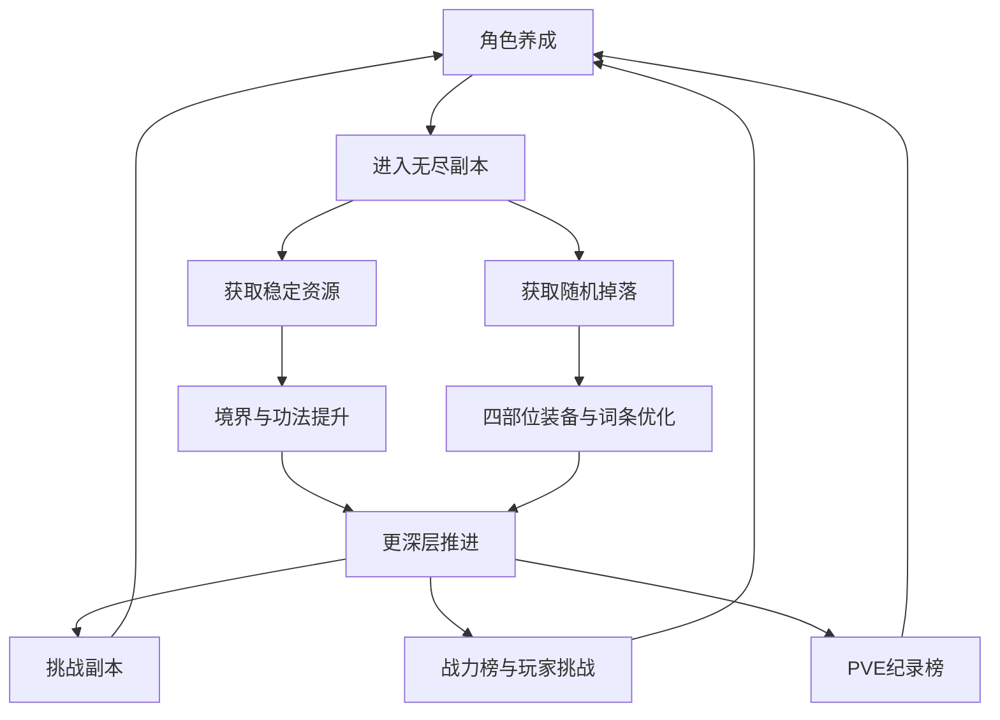
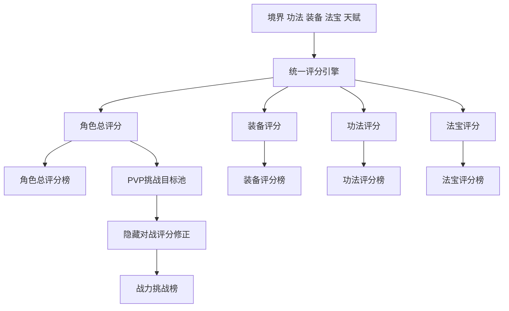

# 修仙文字 BOT 全新设计方案

## 一、项目定位

这是一个以长期 PVE 刷取为核心、以公开排行与异步 PVP 验证成长成果的修仙题材文字 BOT。

核心目标不是一次性通关，而是让玩家围绕同一个角色持续完成以下循环：

**养成构筑 → 刷无尽副本 → 获取稳定资源与高价值随机掉落 → 提升境界、功法、装备、天赋 → 冲击更深层数、战力榜、挑战副本、PVP 名次。**

这个设计的关键不在于单次爆装，而在于同时满足三件事：

- 玩家每次上线都有稳定进度
- 玩家长期刷取始终有极品追求
- 玩家养成成果能够被深度、排行、PVP 结果验证

系统分工必须明确：

- PVE 负责长期成长与刷取动力
- 挑战副本负责机制检验与阶段目标
- PVP 负责名次竞争与成果展示
- 评分系统负责统一比较口径与排行榜扩展基础

## 二、整体循环

长期循环按目标层次拆分为三段：

- 短线目标：提升当前构筑，稳定刷过主力层段
- 中线目标：解锁新区域、形成流派、冲击锚点首领与战力榜位次
- 长线目标：追求高质量词条、深层纪录、排行榜成绩、收藏级掉落

## 三、数值框架

### 1. 主属性设计

建议只保留五项主属性，所有战斗数值都从这五项派生，避免系统过散。

| 主属性 | 主要作用                         |
| ------ | -------------------------------- |
| 体魄   | 提升气血、防御、恢复承载         |
| 灵海   | 提升术法伤害、真元上限、护盾强度 |
| 神识   | 提升命中、暴击、异常命中         |
| 身法   | 提升速度、闪避、先手、追击       |
| 道基   | 提升抗性、成长承载、突破效率     |

派生战斗数值控制在有限集合内：

- 气血
- 真元
- 攻力
- 护体
- 速度
- 暴击
- 暴击伤害
- 命中
- 闪避
- 穿透
- 抗性
- 异常命中
- 异常抵抗

必须提前限制的项目：

- 暴击率
- 闪避率
- 控制成功率
- 穿透
- 减伤
- 护盾转化
- 吸血
- 额外行动
- 追击
- 反击

控制方式采用两类：

- 中高区间递减收益
- 单回合触发上限

原则是允许堆叠，但不允许无限滚雪球。

### 2. 战力与评分来源拆分

建议角色总战力与角色总评分共用同一套来源结构：

| 来源             | 长期占比 | 随机度 | 作用                   |
| ---------------- | -------- | ------ | ---------------------- |
| 境界与基础属性   | 35%      | 低     | 提供稳定底盘与进入门槛 |
| 功法体系         | 25%      | 中低   | 决定流派主轴与技能循环 |
| 四部位装备与祭炼 | 20%      | 中     | 提供稳定装备成长       |
| 词条与特殊道纹   | 15%      | 高     | 承担长期刷取上限       |
| 天赋与收藏成长   | 5%       | 低到中 | 提供构筑微调与长期沉淀 |

这个比例的目的很明确：

- 至少 65% 到 70% 的强度来自可控成长
- 约 30% 的强度来自随机追求

这样既保留刷取兴奋点，也不会因为运气问题直接卡死主线成长。

评分系统在读取这些模块时必须遵守两条原则：

- 公开评分用于展示、排行、榜单扩展
- 公开评分不等于绝对实战胜率，PVP 仍需隐藏对战评分进行修正

## 四、境界、成长资源与货币体系

### 1. 大境界划分

本项目的境界体系直接采用凡人修仙传世界观的大境界结构：

- 凡人
- 炼气
- 筑基
- 结丹
- 元婴
- 化神
- 炼虚
- 合体
- 大乘
- 渡劫
- 真仙
- 金仙
- 太乙玉仙
- 大罗金仙
- 道祖

但首发版本的开放上限只到渡劫。真仙及以上仙道境界保留为后续大版本扩展内容。

渡劫到真仙不视为普通的大境界递进，而视为必须单独设计的一次飞升跃迁。这个阶段后续需要单独补充：

- 飞升条件
- 飞升事件与试炼结构
- 人界与仙界规则切换
- 飞升后的新资源体系与新副本层级

为了方便区域设计、世界层级设计与后续副本命名，可以进一步划分为四段：

| 层级   | 对应境界                             | 设计作用             |
| ------ | ------------------------------------ | -------------------- |
| 凡俗段 | 凡人                                 | 新手起点与凡俗试炼   |
| 人界段 | 炼气、筑基、结丹、元婴、化神         | 主线成长的第一长段   |
| 灵界段 | 炼虚、合体、大乘、渡劫               | 首发版本的主终局阶段 |
| 仙界段 | 真仙、金仙、太乙玉仙、大罗金仙、道祖 | 后续大版本扩展阶段   |

境界提升负责以下内容：

- 提供基础攻防血量
- 提供成长承载上限
- 解锁更高阶功法与副本区域
- 提供有限的境界压制

境界突破不应采用纯概率卡点机制。主线成长不能被脸黑锁死。

### 2. 小阶段结构

每个大境界继续统一划分为四段：

- 初期
- 中期
- 后期
- 圆满

小阶段建议采用统一成长系数：

| 小阶段 | 系数 |
| ------ | ---- |
| 初期   | 1.0  |
| 中期   | 1.45 |
| 后期   | 2.1  |
| 圆满   | 3.0  |

这组系数的作用如下：

- 同一大境界内部成长感足够明显
- 上一境界圆满不会过分接近下一境界初期
- 即使相邻大境界只采用较低倍率，下一境界初期仍能稳定压过上一境界圆满

### 3. 基础量级数值成长曲线

基础量级数值不建议机械地按相邻大境界统一乘 10，而应采用手工配置的境界基准系数表。

设计原则如下：

- 普通相邻大境界采用 6 到 10 倍增长
- 世界层级跃迁采用 12 到 20 倍增长
- 渡劫到真仙、化神到炼虚、大罗金仙到道祖等关键跨界，应当明显高于普通境界跨越

建议基准系数表如下：

| 境界     | 基准系数       |
| -------- | -------------- |
| 凡人     | 1              |
| 炼气     | 10             |
| 筑基     | 60             |
| 结丹     | 420            |
| 元婴     | 3360           |
| 化神     | 30240          |
| 炼虚     | 362880         |
| 合体     | 2903040        |
| 大乘     | 26127360       |
| 渡劫     | 261273600      |
| 真仙     | 5225472000     |
| 金仙     | 41803776000    |
| 太乙玉仙 | 418037760000   |
| 大罗金仙 | 5016453120000  |
| 道祖     | 75246796800000 |

首发版本只使用凡人到渡劫这一段基准系数。真仙及以上的系数先作为远期扩展预留，不纳入首发数值平衡范围。

这张表只服务于基础量级数值，不直接用于修为需求。

适合接入这条曲线的数值包括：

- 气血
- 真元
- 攻力
- 护体
- 护盾量
- 治疗量

推荐基础模板值如下：

- 凡人初期气血：100
- 凡人初期攻力：10
- 凡人初期护体：8
- 凡人初期速度：100

采用这套模板的目的，是在保证凡人到道祖有极大数值跨度的同时，让实现层仍能使用整数安全承载成长结果。

### 4. 百分比与节奏类属性成长原则

闪避、暴击、命中、抗性、减伤、控制成功率、速度这类属性，不应直接套用基础量级数值的成长曲线。

建议统一遵守以下原则：

- 境界只提供少量基础修正与对抗压制修正
- 主要成长空间留给装备、功法、法宝、词条、天赋
- 这类属性应先堆对抗值，再折算最终百分比
- 结算层必须有软上限与硬上限，避免后期失控

推荐占比原则如下：

- 境界层贡献约 20% 到 30%
- 构筑层贡献约 70% 到 80%

这样可以保证：

- 高境界角色更稳定
- 构筑差异仍然有价值
- 百分比属性不会因为境界增长自动接近上限

推荐控制区间如下：

- 暴击率上限：75%
- 闪避率上限：60%
- 控制成功率上限：65%
- 减伤率上限：80%

### 5. 小阶段推进

同一大境界内的小阶段推进建议保持稳定和直接。

小阶段提升建议只检查两项：

- 修为达到当前阶段上限
- 消耗少量稳定产出的成长材料

这一层不再额外增加复杂卡点，它的职责是提供明确、稳定、可预期的成长进度。

### 6. 修为获取结构

修为获取必须同时服务两类玩家：

- 活跃玩家：通过副本、锚点、挑战等主动玩法稳定推进
- 低活跃玩家：通过闭关修炼缓慢推进，不会完全掉队

后续所有修为需求表，建议统一按“标准日修为”来反推。

定义如下：

- 一个角色在当前境界当天拿满闭关收益和主动收益时，记为 1 个标准日修为

标准日修为建议拆成四段：

| 来源         | 占比 | 作用                             |
| ------------ | ---- | -------------------------------- |
| 闭关修炼     | 35%  | 给低活跃玩家提供稳定推进底盘     |
| 主动高效段   | 45%  | 作为活跃玩家当天最核心的修为来源 |
| 主动常规段   | 15%  | 支撑继续刷取时的常规推进         |
| 主动低效尾段 | 5%   | 保留超额在线的补充收益           |

这套结构的目标如下：

- 满肝玩家当天可以拿到 100% 标准日修为
- 纯闭关玩家当天约拿到 35% 标准日修为
- 纯闭关达到同一目标境界，所需时间约为满肝玩家的 2.8 倍
- 活跃玩家的优势会非常明确，但低活跃玩家仍有长期推进路径

为了保证活跃玩法仍然更有价值，闭关修炼的产出应集中在：

- 修为
- 少量感悟积累
- 少量灵石

闭关修炼不应稳定产出以下内容：

- 高品质装备
- 稀有法宝胚子
- 关键突破凭证
- 排行榜核心进度

这样可以形成清晰分工：

- 闭关修炼负责保底成长
- 主动玩法负责高效成长、装备提升、材料积累与排行榜竞争

首发版本只开放到渡劫，因此首发修为总周期建议按以下范围控制：

- 满肝玩家从开局到渡劫圆满，目标周期控制在 25 天到 35 天
- 纯闭关玩家达到同一目标，目标周期控制在 70 天到 100 天

标准日修为映射建议如下：

| 大境界 | 标准日数 | 1 标准日修为值 | 该境界总修为 |
| ------ | -------- | -------------- | ------------ |
| 凡人   | 0.5      | 100            | 50           |
| 炼气   | 1.0      | 300            | 300          |
| 筑基   | 1.5      | 1000           | 1500         |
| 结丹   | 2.0      | 3000           | 6000         |
| 元婴   | 2.5      | 10000          | 25000        |
| 化神   | 3.2      | 30000          | 96000        |
| 炼虚   | 4.0      | 100000         | 400000       |
| 合体   | 4.5      | 300000         | 1350000      |
| 大乘   | 5.0      | 1000000        | 5000000      |
| 渡劫   | 3.0      | 3000000        | 9000000      |

这张映射表的作用如下：

- 标准日数负责控制成长节奏
- 单日修为值负责映射到真实修为表
- 战斗数值曲线与修为曲线分离，避免后期成长周期失控

后续具体界面展示时，建议使用各阶段累计门槛，而不直接向玩家展示分配公式

### 7. 感悟、突破材料与突破资格

大境界突破不建议只看修为条，也不建议加入概率失败。

推荐采用三项固定条件共同组成突破门槛：

- 修为圆满
- 感悟积累达标
- 突破材料与突破资格达标

三项条件各自承担的职责如下：

- 修为圆满负责体现时间投入与刷取积累
- 感悟积累负责让境界成长不只剩单一修为条
- 突破材料与突破资格负责体现阶段门槛与能力验证

感悟的框架建议如下：

- 感悟作为一条通用稳定副资源存在
- 无尽副本稳定结算是感悟的主来源
- 锚点首领奖励、阶段目标、闭关修炼提供补充产出
- 感悟不依赖极低概率掉落，不绑定 PVP 奖励，不允许直接用灵石硬买

突破材料的框架建议如下：

- 首发不做材料转换，降低实现复杂度
- 首发突破材料按世界层级分组，而不是每个大境界完全独立一套材料树
- 首发阶段只开放到渡劫，因此材料先按凡俗、人界、灵界三组规划即可
- 同层级内通过消耗数量递增，体现后续大境界的更高门槛

突破资格的框架建议如下：

- 每个需要突破资格的大境界，对应一个突破秘境难度
- 玩家打通对应突破秘境后，固定获得该境界的突破资格
- 突破资格不做随机掉落，不允许用货币替代
- 突破秘境既承担突破门槛功能，也可以作为挑战秘境存在

这样可以让境界推进同时具备三种特征：

- 有稳定积累
- 有阶段目标
- 有能力验证

必须明确以下原则：

- 只要条件满足，突破就应当固定成功
- 不设计纯概率突破失败
- 不设计失败掉境界
- 不设计极低概率核心道具来卡死主线突破
- 闭关修炼只提供修为和少量感悟，不提供关键突破材料与突破资格

### 8. 境界压制原则

境界压制可以存在，但必须受控：

- 同一大境界内，小阶段差距应当可感知，但不能形成绝对碾压
- 跨大境界要有明显优势，但不能让低境界玩家完全没有越战可能
- 境界压制主要体现在基础量级数值与稳定性优势，而不是直接把百分比属性送到极限

目标是让境界决定稳定底盘，而不是直接决定全部胜负。

### 9. 基础货币与专用资源

本项目需要基础货币体系，但必须克制。

建议只设置一种通用基础货币：

- 灵石

灵石主要承担通用消耗口与基础商店价值，适合放入以下场景：

- 基础商店购买
- 装备洗炼手续费
- 词条重铸手续费
- 功法参悟手续费
- 部分祭炼与法宝培养手续费

灵石的主要来源应当是稳定产出，而不是极端稀缺掉落。建议主要来自：

- 无尽副本稳定结算
- 锚点首领奖励
- 基础任务或阶段目标奖励
- 装备分解回收

与灵石并行，仍然需要保留少量强绑定专用资源：

- 修为
- 感悟积累
- 突破材料
- 祭炼精华
- 功法残页
- 荣誉币

首发经济系统的主消耗口建议固定为三条：

- 装备强化：作为最主要的稳定吞金口
- 词条洗炼与重铸：作为长期毕业追求的主消耗口
- 功法参悟：作为构筑成长的持续消耗口

同时保留两条辅消耗口：

- 法宝培养
- 基础商店购买

货币与资源体系必须满足以下原则：

- 灵石负责通用消耗，不负责解决所有核心成长问题
- 大境界突破不能主要依赖灵石硬买
- 疗伤默认不消耗灵石，而只消耗时间
- PVP 核心进度不作为灵石主消耗口
- 强化与洗炼共同承担装备系统的长期吞金职责
- 不做多层基础货币与复杂兑换链

## 五、功法体系

功法应当是构筑核心，而不是附属数值插件。

建议采用四槽结构：

- 主修功法
- 护体法门
- 身法秘术
- 神识术法

### 1. 功法分工

| 槽位     | 作用                           |
| -------- | ------------------------------ |
| 主修功法 | 决定主要伤害模型与流派主轴     |
| 护体法门 | 决定减伤、回复、护盾、防反路线 |
| 身法秘术 | 决定速度、追击、闪避、节奏控制 |
| 神识术法 | 决定暴击、控制、破防、终结能力 |

### 2. 设计原则

- 主修功法决定构筑方向与自动战斗行为模板
- 主修功法同时决定流派标签，例如剑修、体修、法修等主轴分类
- 护体法门、身法秘术、神识术法只提供支撑，不改写行为逻辑主干
- 其他槽位提供支撑，不应形成全系统互相放大的失控乘算
- 核心功法获取以定向为主，随机为辅
- 功法成长可拆为获取、升级、参悟、突破四层

这样可以让流派有明显差异，但不会因为核心功法完全靠赌而破坏体验。

### 3. 自动战斗与功法行为逻辑

由于本项目以长期刷取为核心，战斗建议默认采用自动结算。

自动战斗的行为逻辑建议只绑定在主修功法上，不采用显式职业系统。

具体原则如下：

- 玩家不直接选择固定职业
- 玩家装备什么主修功法，就表现出什么流派倾向
- 主修功法决定目标选择、行动优先级、资源使用倾向与战斗节奏
- 护体法门、身法秘术、神识术法只做数值强化、条件触发与少量阈值修正
- 辅助功法不改变行为模板类别，不改写决策树主干

这种结构的优点如下：

- 实现更简单，自动战斗不需要处理多套互相抢控制权的行为规则
- 玩家更容易理解自己的构筑为什么会这样战斗
- PVP 中只要公开展示主修功法，就能让对手大致判断战斗风格
- 后续新增流派时，只需要新增主修功法模板，而不需要新增职业系统

首发阶段建议将主修功法的大类先收敛为三条主轴：

- 剑诀系：偏先手、爆发、追击、斩杀
- 炼体系：偏承伤、反击、恢复、持久战
- 术法系：偏群攻、异常、控场、术法循环

这样可以在不增加玩家操作负担的前提下，保留足够清晰的流派差异。

首发三条主轴下，再各自拆出两条子方向骨架：

| 主轴   | 子方向   | 核心定位                         | 更适合的场景               |
| ------ | -------- | -------------------------------- | -------------------------- |
| 剑诀系 | 问心剑道 | 高速单体爆发、残血斩杀、先手压制 | PVP、首领战、突破门槛战    |
| 剑诀系 | 斩情剑道 | 高频连击、追击滚动、稳定持续输出 | PVE 刷图、无尽深刷         |
| 炼体系 | 蛮荒战体 | 高承伤、反震反击、防御转输出     | PVP 防守、高频敌人对抗     |
| 炼体系 | 长生道体 | 护盾恢复、稳定站桩、长战续航     | 日常刷图、高压层段保守推进 |
| 术法系 | 青云术脉 | 群攻爆发、高消耗高收益、快速清场 | PVE 清图、层段推进         |
| 术法系 | 忘川术脉 | 异常状态、控制消耗、反坦压制     | PVP、中长战斗、高护体目标  |

首发整体生态建议形成以下分布：

- 偏 PVE：问心剑道、长生道体、青云术脉
- 偏 PVP 或门槛战：斩情剑道、蛮荒战体、忘川术脉

## 六、装备、词条与天赋

### 1. 装备结构

建议采用四部位：

- 武器
- 护甲
- 饰品
- 法宝

四部位的目标不是简化养成，而是把毕业难度集中到单件质量与单件深度上，而不是通过部位数量硬性拉长流程。

| 部位 | 核心职责               | 优先承载内容                         |
| ---- | ---------------------- | ------------------------------------ |
| 武器 | 决定主要输出底盘       | 攻力、穿透、输出倾向词条             |
| 护甲 | 决定主要生存底盘       | 气血、护体、减伤、抗性               |
| 饰品 | 决定节奏与精细属性     | 暴击、命中、闪避、速度、异常相关     |
| 法宝 | 决定特殊机制与流派强化 | 护盾、控制、触发、召唤、流派专属效果 |

首发品质分级建议固定为四档：

- 普通
- 稀有
- 史诗
- 传说

装备强度拆成四层：

- 底材阶位：决定基础属性区间
- 品质等级：决定附带属性数量、属性上限与高阶词条资格
- 强化等级：提升已有属性数值，并在固定节点开放额外属性成长
- 词条与特殊效果：承担长期毕业追求与流派差异化

### 2. 装备设计原则

- 部位数量减少后，单件装备的强度承载会更高，因此档差必须温和
- 品质决定附带属性数量、强化上限与高阶词条资格，不直接把面板拉到失控
- 强化负责稳定成长，是装备系统中的主线养成环节之一
- 首发强化失败只消耗灵石和强化材料，不掉级、不损坏装备
- 强化等级越高，成功率越低，但不通过掉级制造高惩罚挫败感
- 强化主要提升已有属性，不做高频随机新增属性；只在固定强化节点开放额外属性成长
- 老装备必须可以分解为长期有用材料，避免彻底报废
- 法宝位适合承载高差异、高机制、低数量的特殊内容，但仍要受统一强度预算限制

### 3. 词条系统

词条承担长期刷取上限，但要严格受数值桶控制。

建议分为四类：

- 基础属性词条
- 战斗加成词条
- 条件触发词条
- 特殊道纹词条

首发词条池以 PVE 与 PVP 通用词条为主。

同一效果的词条需要有强度区分。首发建议采用“档位加档内浮动区间”的结构，而不是固定单值。词条档位建议直接采用：

- 黄
- 玄
- 地
- 天

词条档位的职责如下：

- 同效果词条可以形成明确的质量差异
- 每个档位对应一个数值范围，而不是单一固定值
- 同档位的同一词条仍然允许数值差异
- 品质决定可出现的最高词条档位
- 数值类词条重点分档，机制类词条少分档或固定值

不同词条在不同档位之间的数值差距，不要求完全统一；同一档位内部的浮动区间也允许按词条类型分别设计。这部分留到具体实现阶段再细化。

只有少量高阶特殊词条允许做模式专精：

- PVE 专精词条
- PVP 专精词条

这类专精词条可以给出更大胆的加成，但数量必须少，且只应出现在高品质、高稀有层的装备与法宝中，避免首发就把装备池拆成两套完全独立体系。

控制原则：

- 同类词条优先放在同一加算桶内累加
- 最终乘区词条数量必须极少
- 单件装备只允许极少数高阶特殊词条
- 词条洗炼要有定向修正、锁定保留、逐步抬高消耗
- 四部位结构下，单件装备的词条承载上限必须写清预算，避免单件超模

### 4. 天赋系统

天赋不应承担主要战力，而应承担长期沉淀与构筑微调。

建议三条主线：

- 进攻
- 生存
- 效率

天赋的作用更适合放在：

- 调整构筑手感
- 提升刷图效率
- 解锁特定机制节点

而不是直接给出大额无脑增伤。

## 七、无尽核心副本设计

建议将主生产玩法设计为无尽深刷副本，例如命名为“无尽墟界”。

这个副本必须承担全游戏最重要的职责：

- 提供长期稳定资源产出
- 提供极品追求
- 提供深度挑战
- 提供 PVE 纪录榜基础
- 提供四部位装备与法宝的主要掉落来源

### 1. 进入与层数结构

- 前期解锁后永久开放
- 没有总层数上限
- 每 20 层划为一个区域
- 每 5 层出现一次精英节点
- 每 10 层出现一次锚点首领
- 击败锚点首领后，解锁该层段作为后续起点

这一结构能同时提供三种目标：

- 5 层短目标
- 10 层中目标
- 20 层区域跨越的大目标

### 2. 敌人生成逻辑

由于本项目采用自动战斗结算，敌人设计应当以满足构筑验证需求为主，不追求复杂 AI 与重度随机组合。

首发建议采用三层生成结构：

- 模板
- 族群
- 区域偏置

不建议首发引入重随机词缀包与复杂威胁预算系统，以降低实现复杂度和调试成本。

模板建议先收敛为五类：

- 猛攻型：高输出、低生存
- 坚守型：高气血、高护体、低速度
- 灵巧型：高速度、偏闪避、低承伤
- 术法型：高真元、群攻或异常
- 恢复型：低输出、偏回复或护盾

族群层不额外增加复杂行为树，只提供战斗倾向标签，例如：

- 妖兽：高气血、偏猛攻
- 邪修：偏控制、偏吸取
- 傀儡：高护体、低机动
- 灵体：高闪避、偏术法
- 古魔：高爆发、带异常

区域偏置层只承担三项职责：

- 提高某类模板出现率
- 强化某类属性倾向
- 让区域首领围绕同一主题设计

例如：

- 风域：速度系敌人更多
- 炎域：爆发与灼烧更多
- 寒域：减速与控制更多
- 煞域：吸血与持续伤害更多
- 雷域：先手压制更多

首发敌人技能复杂度建议严格收敛：

- 普通怪：1 个主动技能加 1 个被动
- 精英怪：2 个主动技能加 1 个被动
- 锚点首领：2 到 3 个主动技能加 2 个被动

敌人技能应尽量围绕模板主轴服务，不做跨模板的大杂烩。这样既能形成清晰门槛，也能让玩家通过战报快速理解敌人的威胁来源。

### 3. 掉落结构

掉落分为三层：

#### 稳定掉落

- 修炼资源
- 功法残页
- 祭炼精华
- 突破辅助材料

这部分必须稳定结算，保证每次刷图都有真实进度。

#### 定向掉落

- 指定四部位底材
- 指定流派参悟材料
- 词条重铸材料
- 继承与强化材料

这部分负责降低随机挫败感，给玩家修正构筑的主动权。

#### 高价值随机掉落

- 高品质装备
- 异变道纹
- 稀有法宝胚子
- 低概率传承级掉落

这部分负责长期刷取的兴奋点与高上限追求。

四部位结构能够减少底材池稀释，提高目标毕业件的获取效率；长期深度则交给品质、词条、道纹、祭炼和法宝机制来承载。

掉落流程建议采用“过程记录，结束结算”的结构：

- 每层战斗结束后，只在内部记录本次运行的资源增量与潜在高价值掉落
- 玩家主动撤离、战败或触发阶段结算时，再统一确认本次最终保留的掉落
- 副本结算页统一展示本次新增装备、法宝、功法与资源
- 后续若接入 AI 命名，也只对最终成功保留的高价值掉落进行命名，减少调用次数

### 4. 失败与收益关系

失败设计不能全亏，也不能无损。

建议采用双层收益结算：

- 普通层与精英层的稳定收益在过程内累计记录，并在结算页统一入账展示
- 高价值收益先进入未稳收益区
- 玩家主动撤离时，可全额带走
- 在当前层段战败时，只保留稳定收益与部分未稳收益，并承受更重战损

这样能形成真实抉择：

- 保守撤离，稳定回收
- 继续深冲，争取更高收益与纪录

### 5. 战损与疗伤机制

副本刷取不建议设置固定冷却时间，而应通过战损与疗伤限制连续高强度推进。

建议每次副本结束后都保留战损状态，至少记录以下内容：

- 气血缺口
- 真元缺口
- 伤势程度

战损机制的设计原则如下：

- 撤离后不会自动回满状态，玩家需要自己决定是继续刷取还是先疗伤
- 战败、强行深冲、连续挑战高压层数时，伤势应更重
- 带伤继续刷取是可选行为，但会明显降低后续战斗容错

疗伤机制建议如下：

- 提供常驻疗伤选项
- 疗伤不消耗资源
- 疗伤时间不按线性数值公式无限增长，而是采用分段时间
- 例如剩余 50% 气血左右时，恢复时间可以定为 10 分钟；剩余 10% 气血左右时，恢复时间可以提高到 15 分钟或 20 分钟
- 必须设置恢复时间上限，只要角色没有死亡，无论伤势多重，完整恢复都不会超过这个上限
- 时间成本负责限制连续推进速度，而不是用硬性冷却直接截断玩法

这样可以形成更自然的副本节奏：

- 轻度受伤时，停下来恢复的成本可接受
- 重度受伤时，仍然会付出更高时间成本，但不会因为后期高血量数值而出现恢复时间失控
- 想继续冲层，可以带伤冒险
- 想稳住收益，可以先停下疗伤
- 系统限制的是高强度连续刷取速度，而不是玩家进入副本的资格

### 6. 刷取节奏

必须同时支持三种刷法：

- 短刷：从最近锚点刷 5 层左右，主要获取稳定材料
- 中刷：打完 10 层，拿锚点首领奖励
- 深刷：长时间冲层，追求新区、纪录、极品掉落

### 7. 产出控制

建议采用软上限，不采用硬限制：

- 每日或每周前若干次锚点结算，稳定资源效率更高
- 超出高效次数后，稳定资源收益缓降
- 高价值随机掉落概率不下降

这样既保护普通玩家的效率，也保留重度玩家继续刷取极品的动力。

### 8. 长期追求点

无尽副本必须持续提供以下目标：

- 更高锚点层数
- 更深历史记录
- 更高品质底材
- 更完整词条图鉴
- 异变道纹收藏
- 区域首领首通记录
- 深层排行榜

## 八、挑战型副本设计

挑战副本是扩展内容，不是主生产内容。

它的职责是：

- 检验构筑深度
- 提供阶段性证明目标
- 丰富玩法结构

建议后续扩展三类：

### 1. 突破秘境

首发挑战型副本优先采用一套统一的突破秘境系统，例如“破境天关”。

系统内部按世界层级拆成三组主题秘境：

- 入道三关：对应凡俗段与入道人界前期
- 问心道宫：对应人界中后段
- 灵墟天关：对应灵界段与首发终局突破

首发只开放到渡劫，因此突破秘境总计对应九次大境界突破：

- 凡人 → 炼气
- 炼气 → 筑基
- 筑基 → 结丹
- 结丹 → 元婴
- 元婴 → 化神
- 化神 → 炼虚
- 炼虚 → 合体
- 合体 → 大乘
- 大乘 → 渡劫

每个突破难度建议采用统一收敛结构：

- 1 条环境规则
- 1 个守关首领
- 1 次血线阈值变化

不做多波长流程，不做重随机组合，不做复杂路线探索，突出“当前构筑是否具备破境资格”的检验功能。

### 2. 三组突破秘境的主题与资源方向

| 秘境组   | 对应突破                        | 整体风格                         | 重复挑战主资源方向                             |
| -------- | ------------------------------- | -------------------------------- | ---------------------------------------------- |
| 入道三关 | 凡人→炼气、炼气→筑基、筑基→结丹 | 规则直观、数值清楚、教学型门槛   | 灵石、基础强化材料、低阶洗炼材料               |
| 问心道宫 | 结丹→元婴、元婴→化神、化神→炼虚 | 开始强调构筑完整度与主修功法成型 | 感悟积累、功法参悟辅材、中阶洗炼材料           |
| 灵墟天关 | 炼虚→合体、合体→大乘、大乘→渡劫 | 高压环境、终局门槛、压迫感明显   | 高阶强化材料、高阶洗炼材料、中高阶法宝培养材料 |

重复挑战采用定向基础资源高收益结构：

- 每一关只绑定一种主资源方向
- 缺什么资源，就去打对应秘境组或对应关卡
- 主要提供基础成长资源补口，而不是终局极品追求

### 3. 后续扩展型挑战副本

在突破秘境之外，后续版本再扩展以下挑战内容：

- 极限首领副本：强调单体首领机制、输出窗口与应对顺序
- 法则试炼副本：修改全局战斗规则，迫使玩家调整常规构筑
- 构筑限制副本：限制某类功法、词条、行动类型，检验玩家库存深度与多构筑能力

### 4. 防止挑战副本反客为主的规则

必须明确以下限制：

- 挑战副本不掉核心突破资格
- 不掉高品质成品装备、稀有法宝胚子、终局特殊道纹等核心终局资源
- 首通奖励以突破资格、阶段奖励、少量感悟、少量突破材料为主
- 重复挑战可以绑定定向基础资源高收益，但只能绑定少量固定资源方向
- 突破秘境的重复挑战更适合掉落灵石、强化材料、洗炼材料、功法辅材、法宝培养材料等基础资源
- 突破秘境不应同时提供多种高价值资源，避免变成万能刷本
- 同类高收益挑战应有前若干次收益更高、之后回到常规收益的软限制
- 即使有挑战专属装备，也只能是偏场景化强化，不应成为所有模式的通用最优解

## 九、评分系统、PVP 与排行榜

### 1. 评分系统定位

必须维护一套统一评分系统，并明确“万物皆可评分”。

这套系统至少覆盖以下对象：

- 角色总评分
- 装备评分
- 功法评分
- 法宝评分
- 后续可扩展流派评分与收藏评分

评分系统的作用有四项：

- 快速填充基础排行榜
- 作为玩家比较构筑强弱的统一口径
- 为后续装备榜、功法榜、法宝榜提供通用排序能力
- 为 PVP 挑战目标筛选提供显性参考值

评分系统需要拆成两层：

- 公开评分：用于展示、排行、榜单扩展
- 隐藏对战评分：用于目标筛选、匹配修正、反作弊与异常校正

### 2. 角色总评分结构

角色总评分由以下模块共同构成：

- 境界与基础属性
- 功法体系
- 四部位装备底材
- 祭炼继承
- 词条与道纹
- 法宝机制价值
- 天赋与收藏成长

评分必须满足三条要求：

- 可拆解展示，让玩家知道分数来自哪里
- 同类加成进入同类预算，避免单项把总评分拉爆
- 稀有机制可以给分，但不能脱离实际强度预算

公开评分负责展示养成厚度，不直接等于实战胜率预测。流派克制、速度轴、控制链、触发机制，都会影响实战结果。

### 3. PVP 定位

PVP 不承担主养成职责，而承担三项职责：

- 检验构筑成果
- 提供竞争目标
- 展示长期积累

PVP 的排行榜不再依赖 PVE 纪录来间接证明强弱，而是直接围绕角色战力与玩家挑战展开。

### 4. 战力榜与挑战规则

文字 BOT 更适合异步战斗，建议采用“公开战力榜加异步挑战”的结构。

PVP 主入口直接展示角色榜单，并至少展示以下信息：

- 当前榜位
- 角色总评分
- 境界
- 主流派标签
- 防守镜像状态

挑战规则建议如下：

- 玩家从榜单中选择目标发起挑战
- 系统优先推荐名次接近、评分接近、境界接近的目标
- 进攻方挑战防守镜像，由系统自动结算并生成战报
- 挑战胜利后，进攻方提升自己的榜位，防守方后移
- 挑战失败后，进攻方原位保留，降低挫败感

这样可以把榜单直接做成 PVP 入口，而不是把 PVP 建在 PVE 纪录榜之上。

### 5. 目标池、保护与防刷规则

首发 PVP 建议采用轻量、低压力、强展示的常驻竞争结构，不做重赛季与复杂段位树。

为了避免榜单失真和对刷，需要增加以下规则：

- 挑战目标按榜位窗口、公开评分区间、境界分组共同筛选
- 隐藏对战评分用于修正极端流派和异常构筑，避免公开评分接近但实战严重失衡
- 每日有效挑战次数控制在较低水平，首发建议 5 次
- 新进入榜单的玩家有短期保护，避免刚上榜就被连续击落
- 高名次玩家每日有效防守失败次数设置上限，避免短时间内被集中打穿
- 防守快照由系统自动抓取，并在一个结算周期内锁定，避免临时换装规避挑战
- 连续挑战同一目标时，收益递减或直接限制次数，防止反复对刷

防守快照的首发建议如下：

- 玩家不需要手动保存防守阵容
- 系统在首次进入 PVP、发起挑战、或旧快照过期后的相关行为中自动抓取当前构筑
- 快照锁定期内，被挑战时始终使用当前有效快照

### 6. 奖励定位

PVP 奖励应以荣誉与展示为主：

- 荣誉币
- 榜单位次奖励
- 常驻称号或周结算称号
- 榜单徽记
- BOT 角色面板专属边框或头像外框
- 少量词条微调材料

必须明确：

- 首发展示奖励不依赖 Discord 原生头像框或原生资料卡边框
- 所有边框与外框奖励都应由 BOT 自己生成在角色面板、榜单展示和战报展示中

必须禁止以下设计：

- PVP 独占突破材料
- PVP 独占毕业核心装备
- 不打 PVP 就明显落后的主线成长资源

### 7. 排行榜结构

首批建议开放以下榜单：

- 角色总评分榜
- 战力挑战榜
- 无尽深度榜
- 挑战副本首通榜

评分系统稳定后，可以继续扩展：

- 装备评分榜
- 功法评分榜
- 法宝评分榜
- 流派评分榜

这样榜单体系既有当前可玩的竞争目标，也有后续可持续扩展的展示空间。

### 8. 评分与榜单数据流

## 十、随机系统设计

随机性必须分层设计，不能所有地方都高随机。

### 1. 适合高随机的部分

| 系统               | 作用                   |
| ------------------ | ---------------------- |
| 装备品质与词条组合 | 承担长期刷取上限       |
| 异变道纹           | 承担极低概率高价值目标 |
| 无尽副本隐藏事件   | 提供复刷新鲜感         |
| 区域词缀与首领组合 | 提供战斗变化           |

### 2. 必须收敛的部分

| 系统         | 收敛原因               |
| ------------ | ---------------------- |
| 境界突破     | 主线进度不能靠运气     |
| 主修功法获取 | 流派入口不能被概率锁死 |
| 祭炼等级     | 换装不能导致长期倒退   |
| 基础资源产出 | 每次上线都必须有进度   |
| PVP 主奖励   | 不能反向绑架养成体系   |

### 3. 随机控制原则

- 高随机系统必须配套定向修正机制
- 单个系统可以有高上限，但多个系统不能同时无限上限
- 随机结果必须落在预设强度预算内
- 随机负责制造惊喜，不负责承担主线进度
- 评分系统读取随机结果时，必须经过预算归一，避免单件极品把榜单结构直接拉崩

## 十一、长期运营的数值控制原则

### 1. 主线成长稳定，极品追求长期存在

主线成长应由以下系统承担：

- 境界
- 功法
- 祭炼

极品追求应由以下系统承担：

- 词条
- 异变道纹
- 深层掉落

这样普通玩家可以稳定变强，重度玩家也始终有更高目标可追。

### 2. 严格控制乘区

后期崩坏的根源通常不是单一数值过高，而是多个系统互相独立乘算。

必须预先划分数值桶：

- 基础区
- 增伤区
- 暴击区
- 穿透区
- 最终乘区

最终乘区必须数量极少，并设置预算与封顶。

### 3. 新版本优先增加选择，不优先抬高天花板

后续版本优先新增：

- 新区域
- 新机制
- 新流派路线
- 新词条池
- 新挑战规则

不优先采用以下做法：

- 全系统直接翻倍
- 新装完全碾压旧装
- 旧毕业内容整体报废

### 4. 产出要有软上限，消耗要有长期回收口

长期回收口建议放在：

- 装备分解
- 词条洗炼
- 定向重铸
- 功法参悟
- 法宝培养

这样可以避免资源持续堆积而失控。

### 5. 毕业必须分层

建议将毕业拆成三层：

- 主线毕业：能稳定刷当前主力层段
- 构筑毕业：核心流派完整成型
- 极限毕业：词条、道纹、纪录都接近极限

这样玩家不会过早失去长期目标。

### 6. 深层内容增加机制密度，不只增加面板

越往深层，主要增加的应该是：

- 环境规则复杂度
- 怪物词缀复杂度
- 首领节奏变化
- 掉落池质量

不应只是单纯提高血量与攻击。

### 7. PVE 与 PVP 分开平衡

PVE 强势构筑与 PVP 强势构筑可以不同，但两边都不能通过独占资源强迫玩家跨模式参与。

公开评分、隐藏对战评分与 PVE 环境强度也可以采用不同权重，避免同一套数值口径同时压坏两个模式。

### 8. 新系统上线前必须先写清楚强度预算

每个新增系统上线前都必须先明确三件事：

- 它占总战力多少比例
- 它进入哪个数值桶
- 它是横向选择还是纵向提升

这一步不做，后续数值一定失控。

## 十二、版本落地顺序

### 首发版本

首发只做核心主循环：

- 境界主线，开放范围到渡劫为止
- 基础功法体系
- 四部位装备
- 词条系统
- 祭炼继承
- 一个完整无尽副本
- 统一评分系统
- 基础角色总评分榜
- 基础异步 PVP 与战力挑战榜

首发目标只有一个：

**先把凡俗段、人界段、灵界段的长期刷取、稳定成长、冲层目标、玩家挑战四件事做扎实。**

真仙及以上仙道境界不进入首发版本。渡劫到真仙的飞升跃迁保留为后续需要单独设计的大版本内容。

### 后续版本一

在不破坏主循环的前提下扩展：

- 首批挑战副本
- 更多区域与词缀池
- 更多功法流派分支
- 词条定向修正功能
- 无尽副本新区段
- 装备评分榜与功法评分榜

### 后续版本二

进入长期运营阶段后，再扩展：

- 高阶挑战副本组
- 更深层异变掉落
- 更多法则型区域
- 赛季化展示目标
- 收藏与图鉴成长
- 更复杂的流派联动内容
- 法宝评分榜与流派评分榜

版本顺序不能颠倒。必须先把无尽副本、统一评分体系与玩家挑战循环做稳，再追加挑战、赛季、收藏与展示内容。

## 十三、结论

这套设计的核心结构可以概括为四条：

- 把稳定成长放在境界、功法、祭炼
- 把长期刷取动力放在无尽副本、词条、异变掉落
- 把竞争与证明放在战力榜、玩家挑战与排行榜展示
- 把榜单扩展能力放在统一评分系统

这样可以同时满足以下目标：

- 给足长期刷取动力
- 保持数值可控
- 让 PVE 成为主养成来源
- 让 PVP 成为成果检验手段
- 让评分系统成为后续装备榜、功法榜、法宝榜的公共基础
- 让系统具备高随机上限与长期扩展空间

这个方案适合作为新工作区中的立项设计基线，并据此继续拆分玩法原型、养成原型、战斗原型与版本开发计划。
