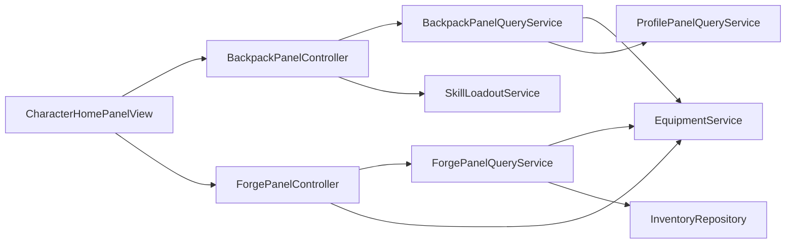

# 背包与锻造重构实施方案

## 1. 文档定位

- 本文只定义方案，不包含任何实现代码。
- 后续 Code 模式以本文作为本次重构的唯一事实来源。
- 本次重构目标是把当前混合在同一私有面板中的实例浏览、装备装配、功法装配、资源培养操作拆开，形成两个职责清晰的私有面板：背包 与 锻造。
- 本次重构不涉及数据库表结构变更，不新增迁移。

---

## 2. 当前实现结论

### 2.1 现状入口与耦合点

1. 公开主面板入口在 `src/infrastructure/discord/character_panel.py`。
2. 当前私有装备面板入口、Presenter、View、Controller、动作回写、功法详情、法宝培养、资源反馈，全都混在 `src/infrastructure/discord/equipment_panel.py`。
3. 当前 `EquipmentPanelController` 同时承载三种展示模式：
   - HUB
   - SLOT_DETAIL
   - SKILL_DETAIL
4. 当前 `EquipmentPanelQueryService` 聚合了四类数据：
   - 装备集合
   - 按槽位分组的候选列表
   - 功法快照
   - 最近掉落摘要
5. 当前公开主面板只有 装备 按钮，没有 锻造 按钮。
6. 当前 slash command 只有 `/修仙 装备`，没有 `/修仙 背包` 或 `/修仙 锻造`。

### 2.2 当前实现与新产品方向的冲突点

1. 当前面板是 槽位驱动，不是 实例驱动。
   - 现有 `EquipmentSlotPanelSnapshot` 适合按部位查看候选装备。
   - 不适合做 装备 实例 + 法宝实例 + 功法实例 的统一背包分页浏览。
2. 当前面板默认展示资源、摘要、最近掉落。
   - 与 背包不放资源栏、不显示摘要 的要求冲突。
3. 当前详情页会自动选中第一件候选装备。
   - 与 只有被选中后才显示详细信息 的要求冲突。
4. 当前功法详情仍然属于 旧装备面板 的一个 display mode。
   - 新方向要求把 功法实例浏览与装配并入背包筛选，不再保留独立功法详情页作为一级模式。
5. 当前强化、洗炼、重铸、法宝培养、分解与浏览混在同一 View。
   - 与 背包 和 锻造 职责边界冲突。

### 2.3 必须保留的既有能力

1. `EquipmentService` 已经稳定提供以下写操作：
   - 装备装配
   - 卸下装备
   - 强化
   - 洗炼
   - 重铸
   - 法宝培养
   - 分解
2. `SkillLoadoutService` 已经稳定提供：
   - 功法实例装配
   - 功法背包读取
3. `ProfilePanelQueryService.get_skill_snapshot` 已经提供：
   - 当前装配中的功法
   - 拥有的功法实例
4. `EquipmentService.list_equipment` 已经提供：
   - active_items
   - equipped_items
   - spirit_stone
5. `DiscordInteractionVisibilityResponder` 的私有面板发送、编辑、超时回收逻辑可以原样复用。

---

## 3. 最终职责边界

## 3.1 背包

背包只负责以下内容：

1. 实例浏览
2. 实例筛选
3. 分页
4. 选中某实例后展示详情
5. 同步展示 已装备的同类实例 详情用于对比
6. 对选中实例执行 装配
   - 装备与法宝调用 `EquipmentService.equip_item`
   - 功法调用 `SkillLoadoutService.equip_skill_instance`

背包明确不负责：

1. 资源栏
2. 最近掉落
3. 已装备摘要
4. 法宝概况
5. 功法概况
6. 强化
7. 洗炼
8. 重铸
9. 法宝培养
10. 分解
11. 任何资源消耗型培养反馈

## 3.2 锻造

锻造只负责以下内容：

1. 资源栏展示
2. 已装备目标选择
3. 强化
4. 洗炼
5. 重铸
6. 法宝培养
7. 分解
8. 卸下装备

锻造明确不负责：

1. 背包实例分页浏览
2. 功法实例装配
3. 功法背包筛选
4. 全部 active_items 浏览
5. 最近掉落摘要
6. 背包式跨类型实例列表

### 3.3 卸下装备的归属说明

虽然 卸下装备 不消耗资源，但它仍然属于 对当前已装备目标做管理 的操作，因此放在 锻造，不放在 背包。

原因：

1. 背包保持单一职责，只做 实例浏览 + 对比 + 装配。
2. 锻造本身是 已装备目标驱动，卸下逻辑与强化、洗炼、重铸共用同一目标选择状态。
3. 可以避免背包出现 装配 与 卸下 两种相反方向动作，降低 UI 歧义。

---

## 4. 最终文件结构与职责分配

## 4.1 新增文件

### 应用层

1. `src/application/equipment/backpack_query_service.py`
   - 背包只读聚合
   - 负责过滤、排序、分页、选中项详情、同类已装备对比模型
2. `src/application/equipment/forge_query_service.py`
   - 锻造只读聚合
   - 负责资源栏、当前可锻造目标、已装备目标详情、操作可用性

### Discord 基础设施层

3. `src/infrastructure/discord/backpack_panel.py`
   - `BackpackPanelController`
   - `BackpackPanelPresenter`
   - `BackpackPanelView`
   - `BackpackPanelState`
   - `BackpackFilterSelect`
   - `BackpackItemSelect`
4. `src/infrastructure/discord/forge_panel.py`
   - `ForgePanelController`
   - `ForgePanelPresenter`
   - `ForgePanelView`
   - `ForgePanelState`
   - `ForgeSlotSelect`
   - `ForgeWashAffixSelect`
5. `src/infrastructure/discord/equipment_panel_common.py`
   - 共享格式化器与共用说明对象
   - 不保留任何面板控制流

### 测试

6. `tests/integration/test_stage10_backpack_panel_flow.py`
7. `tests/integration/test_stage10_forge_panel_flow.py`

## 4.2 需要修改的现有文件

1. `src/infrastructure/discord/character_panel.py`
   - 把 装备 按钮改成 背包
   - 新增 锻造 按钮
   - `CharacterPanelController` 新增背包与锻造入口方法
2. `src/infrastructure/discord/client.py`
   - 新增 `/修仙 背包`
   - 新增 `/修仙 锻造`
   - 旧 `/修仙 装备` 迁移为兼容入口或直接替换为 背包
3. `src/bot/bootstrap.py`
   - 注册并注入新 query service 与新 controller
4. `src/bot/bootstrap.py` 中的 `ApplicationServiceBundle`
   - 新增 `backpack_panel_query_service`
   - 新增 `forge_panel_query_service`
5. `src/application/equipment/panel_query_service.py`
   - 不再作为新 UI 的直接快照入口
   - 迁移后只保留共享 helper 或作为过渡兼容层

## 4.3 `equipment_panel.py` 的处理原则

### 最终目标

`src/infrastructure/discord/equipment_panel.py` 不再承载任何新私有面板逻辑。

### 迁移策略

分两步处理：

1. 先新增 `backpack_panel.py` 与 `forge_panel.py`，并把新入口切过去。
2. 确认所有 import 与测试已迁移后，再删除 `equipment_panel.py` 或把它缩减为仅含兼容转发的废弃壳文件。

### 明确决策

- 不允许继续在 `equipment_panel.py` 上堆新 display mode。
- 不允许把 背包 与 锻造 再次塞回同一个 Controller。
- 不允许继续复用 `EquipmentPanelDisplayMode.HUB / SLOT_DETAIL / SKILL_DETAIL` 作为新状态模型。

---

## 5. Presenter / View / Controller 分层设计

## 5.1 Backpack 面板分层

### `BackpackPanelController`

职责：

1. 接收 Discord 交互事件
2. 维护并标准化 `BackpackPanelState`
3. 调用 `BackpackPanelQueryService` 读取只读快照
4. 根据选中实例类型分发写操作
   - equipment 或 artifact -> `EquipmentService.equip_item`
   - skill -> `SkillLoadoutService.equip_skill_instance`
5. 写操作后重载快照并回写 embed

禁止事项：

- 不在 controller 中拼接长文本详情
- 不在 controller 中手写列表分页逻辑之外的展示逻辑

### `BackpackPanelPresenter`

职责：

1. 只根据 `BackpackPanelSnapshot + BackpackPanelState + action_note` 生成 embed
2. 渲染以下区块：
   - 当前筛选与分页
   - 当前页实例列表
   - 选中实例详情
   - 已装备同类实例详情
   - 最近一次动作反馈

禁止事项：

- 不访问数据库
- 不直接调用 service
- 不推导复杂业务规则

### `BackpackPanelView`

职责：

1. 持有 Discord 组件
2. 做 owner 校验
3. 将筛选、分页、实例选择、装配按钮回调转发给 controller

禁止事项：

- 不保存必须跨重建持久化的业务状态
- 不直接执行 service 写操作

## 5.2 Forge 面板分层

### `ForgePanelController`

职责：

1. 接收 Discord 交互
2. 维护并标准化 `ForgePanelState`
3. 调用 `ForgePanelQueryService`
4. 分发以下写操作：
   - 强化
   - 洗炼
   - 重铸
   - 法宝培养
   - 分解
   - 卸下装备
5. 在需要确认或锁词条的动作中维护 pending state

### `ForgePanelPresenter`

职责：

1. 只负责资源栏、当前目标详情、操作提示、动作反馈渲染
2. 不承担背包式列表职责

### `ForgePanelView`

职责：

1. 只承载锻造目标选择与锻造操作按钮
2. 对洗炼场景动态挂载 `ForgeWashAffixSelect`
3. owner 校验复用既有私有面板模式

## 5.3 共享层

`src/infrastructure/discord/equipment_panel_common.py` 只保留以下共用逻辑：

1. `EquipmentActionNote`
2. 装备详情格式化
3. 功法详情格式化
4. 词条行格式化
5. 资源变化行格式化
6. 资源名、属性名、槽位名等映射

共享层不允许包含：

1. `discord.ui.View`
2. `discord.ui.Select`
3. Controller
4. Session 打开逻辑

---

## 6. 应用层读模型设计

## 6.1 必须优先复用的现有读模型

以下模型优先复用，不重新造轮子：

1. `EquipmentCollectionSnapshot`
2. `EquipmentItemSnapshot`
3. `SkillPanelSnapshot`
4. `SkillPanelSkillSlotSnapshot`
5. `EquipmentResourceLedgerEntry`

复用原因：

1. 这些模型已经覆盖当前装备、法宝、功法详情所需核心字段。
2. 已被现有集成测试验证。
3. 写操作返回值已经依赖这些模型，继续复用可以降低 presenter 重写成本。

## 6.2 明确不再直接复用的旧快照

### `EquipmentPanelSnapshot`

不再作为新面板的直接输入快照。

原因：

1. 它强绑定旧 HUB 模式。
2. 它把 背包 与 功法概况 与 最近掉落 绑在一起。
3. 它没有分页与筛选状态语义。
4. 它没有混合实例列表的统一 entry key 概念。

### `EquipmentSlotPanelSnapshot`

不作为背包主快照复用。

原因：

1. 它是 槽位视角，不是 实例视角。
2. 它无法表达 全部、法宝、功法 这类跨槽位混合分页。
3. 它天然带 candidate_items 自动首选语义，不适合 选中后才显示详情。

### 保留场景

`EquipmentSlotPanelSnapshot` 可以只在 Forge 中作为迁移期参考实现，但最终建议 Forge 使用新的 `ForgeTargetSnapshot`，避免把 candidate_items 带进锻造读模型。

---

## 7. Backpack 读模型与状态模型

## 7.1 新增读模型

建议在 `src/application/equipment/backpack_query_service.py` 中定义：

### `BackpackEntryKind`

枚举值：

- `equipment`
- `skill`

### `BackpackFilterId`

枚举值：

- `all`
- `weapon`
- `armor`
- `accessory`
- `artifact`
- `skill`

### `BackpackEntryKey`

字段：

- `entry_kind`
- `item_id`

用途：

1. 作为选中项唯一标识
2. 解决 equipment item id 与 skill item id 可能数值重叠的问题
3. Discord Select 的 `value` 统一序列化为：
   - `equipment:1002`
   - `skill:3012`

### `BackpackEntrySummarySnapshot`

字段建议：

- `entry_key`
- `entry_kind`
- `item_id`
- `slot_id`
- `slot_name`
- `display_name`
- `quality_name`
- `rank_name`
- `equipped`
- `is_artifact`
- `summary_line`

### `BackpackSelectedDetailSnapshot`

字段建议：

- `entry_key`
- `entry_kind`
- `equipment_item` 或 `skill_item`
- `equip_action_enabled`
- `equip_action_label`
- `same_type_equipped_entry_key`
- `same_type_equipped_equipment_item` 或 `same_type_equipped_skill_item`
- `is_same_as_equipped`

### `BackpackPanelSnapshot`

字段建议：

- `character_id`
- `character_name`
- `filter_id`
- `page`
- `page_size`
- `total_items`
- `total_pages`
- `page_entries`
- `selected_detail`

## 7.2 `BackpackPanelState`

建议定义在 `src/infrastructure/discord/backpack_panel.py`：

字段：

- `filter_id`
- `page`
- `selected_entry_key`
- `action_note`

约束：

1. `page` 使用 1-based。
2. 打开背包默认：
   - `filter_id = all`
   - `page = 1`
   - `selected_entry_key = None`
3. 筛选变化时：
   - 重置 `page = 1`
   - 清空 `selected_entry_key`
4. 翻页时：
   - 保留 `filter_id`
   - 如果原选中项不在新页，则清空 `selected_entry_key`
5. 装配成功后：
   - 保留 `filter_id`
   - 保留 `page`
   - 尝试保留 `selected_entry_key`
   - 若实例已不存在或不再属于当前筛选结果，清空选中

## 7.3 过滤规则

- `all`：装备实例 + 法宝实例 + 功法实例
- `weapon`：`slot_id == weapon` 的装备实例
- `armor`：`slot_id == armor` 的装备实例
- `accessory`：`slot_id == accessory` 的装备实例
- `artifact`：`slot_id == artifact` 或 `is_artifact == true` 的法宝实例
- `skill`：`SkillPanelSnapshot.owned_skills`

## 7.4 排序规则

### `all` 视图的排序顺序

按以下顺序稳定排序：

1. 类别顺序
   - weapon
   - armor
   - accessory
   - artifact
   - skill
2. 类别内排序

装备与法宝：

- 已装备优先
- 品质高优先
- 强化等级高优先
- item_id 新优先

功法：

- 已装配优先
- 槽位顺序 main -> guard -> movement -> spirit
- 品质高优先
- item_id 新优先

### 说明

- 背包不要直接复用旧 `EquipmentPanelQueryService._candidate_sort_key` 作为 all 视图排序。
- 旧排序只适合单槽位候选装备，不适合混合背包。

## 7.5 分页规则

1. `page_size = 25`
2. `BackpackItemSelect` 只承载当前页条目
3. 当前页无条目时：
   - 不挂载 `BackpackItemSelect`
   - embed 只显示 空背包 或 当前筛选无实例
4. 背包打开时不自动展示任何详情
5. 只有用户显式选择某实例后，才显示：
   - 选中实例详情
   - 已装备同类实例详情

## 7.6 同类实例对比规则

### 装备与法宝

- 同类 = 相同 `slot_id`
- 对比对象 = 当前角色该 `slot_id` 上已装备的 active item

### 功法

- 同类 = 相同 `slot_id`
  - `main`
  - `guard`
  - `movement`
  - `spirit`
- 对比对象 = 当前角色该槽位已装配的 skill instance

### 特殊情况

如果选中的实例本身就是已装备同类实例：

- 不隐藏对比区块
- 对比区块明确显示 当前已装备同类实例即该实例
- 仍沿用同一详情渲染器，避免 presenter 分叉

---

## 8. Forge 读模型与状态模型

## 8.1 新增读模型

建议在 `src/application/equipment/forge_query_service.py` 中定义：

### `ForgeResourceSnapshot`

字段建议：

- `spirit_stone`
- `enhancement_stone`
- `enhancement_shard`
- `wash_dust`
- `spirit_sand`
- `spirit_pattern_stone`
- `soul_binding_jade`
- `artifact_essence`

### `ForgeTargetSnapshot`

字段建议：

- `slot_id`
- `slot_name`
- `core_role`
- `equipped_item`
- `supported_operations`

说明：

- `supported_operations` 对 weapon、armor、accessory、artifact 可不同。
- artifact 支持 法宝培养。
- skill 不进入 Forge。

### `ForgePanelSnapshot`

字段建议：

- `character_id`
- `character_name`
- `resources`
- `targets`

## 8.2 `ForgePanelState`

建议定义在 `src/infrastructure/discord/forge_panel.py`：

字段：

- `selected_slot_id`
- `pending_action`
- `selected_locked_affix_positions`
- `action_note`

### `pending_action` 枚举

- `none`
- `wash`
- `reforge`
- `dismantle`

### 默认规则

1. 面板打开时优先选中 第一个已装备槽位。
2. 如果没有任何已装备目标，则默认选中静态顺序中的第一个槽位，并展示 暂无可锻造目标。
3. 切换槽位时：
   - 清空 `pending_action`
   - 清空 `selected_locked_affix_positions`
   - 清空准备态 action_note
4. 刷新时保留 `selected_slot_id`，但若该槽位失效则回退到第一可用槽位。

## 8.3 Forge 展示规则

锻造面板必须包含：

1. 资源栏
2. 当前选中槽位
3. 当前已装备目标详情
4. 动作反馈

锻造面板不包含：

1. 背包实例翻页列表
2. 功法列表
3. 最近掉落
4. 背包式筛选摘要

## 8.4 Forge 操作规则

### 强化

- 直接执行
- 成功后刷新当前槽位详情与资源栏

### 洗炼

- 第一步进入 `pending_action = wash`
- 第二步展示 `ForgeWashAffixSelect`
- 第三步点击 执行洗炼
- 刷新后清空 pending state

### 重铸

- 双击确认模式
- 第一次进入 `pending_action = reforge`
- 第二次点击确认执行

### 分解

- 双击确认模式
- 只对当前已装备目标生效
- 执行后当前槽位变为空
- 刷新后资源栏变化由 `EquipmentResourceLedgerEntry` 渲染

### 法宝培养

- 仅 `slot_id == artifact` 且当前有已装备法宝时启用

### 卸下装备

- 不进入背包
- 仍由 Forge 执行
- 执行后当前槽位变为空，目标回到背包 active_items

---

## 9. 现有查询服务与快照的复用策略

## 9.1 背包优先复用

### `EquipmentService.list_equipment`

用途：

- 获取所有 active equipment 与 currently equipped equipment

### `ProfilePanelQueryService.get_skill_snapshot`

用途：

- 获取 `owned_skills`
- 获取当前功法装配快照
- 获取角色名

### `SkillLoadoutService.equip_skill_instance`

用途：

- 背包中功法装配动作

### `EquipmentService.equip_item`

用途：

- 背包中装备与法宝装配动作

## 9.2 锻造优先复用

### `EquipmentService.list_equipment`

用途：

- 获取已装备目标
- 获取 spirit_stone

### `InventoryRepository.list_by_character_id_and_type`

用途：

- 读取 `material` 类型库存
- 生成 Forge 资源栏

### `EquipmentService`

直接复用写操作：

- `enhance_equipment`
- `wash_equipment`
- `reforge_equipment`
- `nurture_artifact`
- `dismantle_equipment`
- `unequip_item`

### `EquipmentResourceLedgerEntry`

用途：

- 统一渲染锻造资源变化反馈

## 9.3 不建议复用的旧投影

以下旧投影仅作迁移参考，不建议直接继续喂给新 Presenter：

1. `EquipmentPanelSnapshot`
2. `EquipmentPanelDisplayMode`
3. `EquipmentPanelView`
4. `EquipmentPanelPresenter`

原因：

- 这些对象隐含旧面板的 HUB / 槽位详情 / 功法详情 三态设计，会把新职责重新耦合回去。

---

## 10. 公开主面板与入口联动方案

## 10.1 `character_panel.py`

### `CharacterHomePanelView`

将 row 1 按钮调整为：

1. 修炼
2. 无涯渊境
3. 突破秘境
4. 背包
5. 锻造

说明：

- Discord 一行最多 5 个按钮，这个布局刚好符合限制。

### `CharacterPanelController`

新增字段：

- `_backpack_panel_controller`
- `_forge_panel_controller`

新增方法：

- `open_backpack_panel`
- `open_forge_panel`

移除或废弃：

- `open_equipment_panel`

### `PrivatePanelController` 协议

无需修改。

原因：

- 新背包与锻造控制器都可以继续实现 `open_panel(interaction, character_id)`。

## 10.2 `client.py`

### 新命令

- `/修仙 背包`
- `/修仙 锻造`

### 旧命令 `装备`

兼容策略二选一：

#### 首选策略

- 直接替换为 `/修仙 背包`
- 不再注册 `/修仙 装备`

#### 兼容策略

- 临时保留 `/修仙 装备`
- 其行为等价于打开背包
- 待下一次命令清理时删除

本方案首选 直接替换。

## 10.3 `bootstrap.py`

必须同时改三处：

1. 构造 `BackpackPanelQueryService`
2. 构造 `ForgePanelQueryService`
3. 构造 `BackpackPanelController` 与 `ForgePanelController`
4. 注入 `CharacterPanelController`
5. 注入 `XianBotClient`
6. 扩展 `ApplicationServiceBundle`

---

## 11. 视图交互细节

## 11.1 Backpack 组件布局

### 组件

1. `BackpackFilterSelect`
2. `BackpackItemSelect`
3. `上一页` 按钮
4. `下一页` 按钮
5. `刷新` 按钮
6. `装配` 按钮

### 展示逻辑

- 如果当前筛选结果为空：
  - 不显示 `BackpackItemSelect`
  - `装配` 按钮禁用
- 如果当前页没有选中项：
  - 不显示详情字段
  - 不显示对比字段
- 如果有选中项：
  - 同时显示选中详情 与 已装备同类详情

### Select 描述字段限制

Discord Select option description 长度有限，必须只放短摘要。

建议：

- 装备与法宝：`品质｜阶数｜强化 或 祭炼`
- 功法：`槽位｜阶数｜品质`

## 11.2 Forge 组件布局

### 组件

1. `ForgeSlotSelect`
2. `刷新` 按钮
3. `强化` 按钮
4. `洗炼` 或 `执行洗炼` 按钮
5. `重铸` 或 `确认重铸` 按钮
6. `分解` 或 `确认分解` 按钮
7. `法宝培养` 按钮
8. `卸下装备` 按钮
9. `ForgeWashAffixSelect` 动态组件

### 动态规则

- 非 artifact 槽位时隐藏 法宝培养
- 非 wash pending 时隐藏 `ForgeWashAffixSelect`
- 当前槽位没有已装备目标时，所有锻造动作禁用

---

## 12. 动作回写与状态保持规则

## 12.1 Backpack

写操作后统一执行：

1. 重新读取 `BackpackPanelSnapshot`
2. 保持当前 `filter_id`
3. 保持当前 `page`
4. 尝试恢复 `selected_entry_key`
5. 若恢复失败，则清空选中
6. 回写动作结果到 `action_note`

## 12.2 Forge

写操作后统一执行：

1. 重新读取 `ForgePanelSnapshot`
2. 保持当前 `selected_slot_id`
3. 清空 `pending_action`
4. 清空 `selected_locked_affix_positions`
5. 在 `action_note` 中显示结果与资源变化
6. 若当前槽位已无目标，Presenter 负责把该槽位渲染为空状态

## 12.3 为什么状态必须显式建模

当前项目在编辑消息时通常会重建新的 `View`。

因此以下状态不能只放在旧 View 实例里：

1. 背包筛选状态
2. 背包分页状态
3. 背包选中项
4. Forge 当前选中槽位
5. Forge pending action
6. Forge 洗炼锁词条状态

结论：

- 新面板必须使用显式 `PanelState` 数据对象，由 controller 负责传递与归一化。

---

## 13. 测试迁移方案

## 13.1 保留并迁移的测试意图

从旧 `test_stage10_equipment_panel_flow.py` 中迁移以下测试意图：

1. 功法实例装配成功后刷新私有面板并显示动作反馈
2. 卸下装备后物品回到 active_items
3. artifact 槽位只有在已装备法宝时才出现法宝培养入口
4. 洗炼锁词条交互正确
5. 资源变化正确显示

## 13.2 Backpack 必须新增的测试

1. 默认打开背包时不显示任何实例详情
2. 切换筛选后页码重置为 1 且清空选中项
3. 翻页后若选中项不在新页则清空选中项
4. equipment 与 skill 使用复合 entry key，不会发生 id 冲突
5. 选中某装备实例后会显示已装备同槽位实例详情
6. 选中某功法实例后会显示已装配同槽位实例详情
7. 背包装配装备成功后只刷新背包，不进入锻造逻辑
8. 背包装配功法成功后仍停留在背包当前筛选与页码

## 13.3 Forge 必须新增的测试

1. 打开锻造时资源栏显示 spirit_stone 与材料库存
2. 切换槽位会清空 pending state
3. 当前槽位为空时所有锻造动作禁用
4. wash 进入准备态后会显示锁词条选择器
5. reforge 与 dismantle 采用双击确认逻辑
6. artifact 槽位显示法宝培养，其他槽位不显示
7. 分解成功后资源栏与目标区同步刷新
8. 卸下装备成功后当前槽位变空，背包数据源可重新看到该实例

## 13.4 主面板与命令入口测试

1. 公开主面板按钮文本包含 背包 与 锻造
2. 不再显示 装备 按钮
3. slash command 正确打开背包与锻造

---

## 14. 潜在风险点

## 14.1 复合实例 id 冲突风险

风险：

- equipment item id 与 skill item id 都是整数，混合背包若只传裸数字会产生选中冲突。

规避：

- 必须使用 `BackpackEntryKey`，Select value 格式固定为 `equipment:ID` 或 `skill:ID`。

## 14.2 旧自动首选逻辑污染新背包

风险：

- 旧 `EquipmentPanelPresenter._resolve_selected_candidate` 会在未选中时回退到第一项。

规避：

- 背包不得复用该自动首选语义。
- `selected_entry_key is None` 时，Presenter 不渲染详情区。

## 14.3 资源物料 id 历史遗留差异

风险：

- 当前运行时资源映射使用：
  - `wash_dust`
  - `spirit_pattern_stone`
  - `soul_binding_jade`
- 旧测试辅助中仍出现过：
  - `wash_jade`
  - `seal_talisman`
  - `reforge_crystal`

规避：

- 新 Forge 资源栏以 `EquipmentService` 和现行静态配置中的 canonical resource id 为准。
- 测试需要一起清理为当前正式资源 id。

## 14.4 背包 all 视图排序不稳定风险

风险：

- 如果直接拼接 equipment 与 skill 列表而不定义统一排序，分页会抖动。

规避：

- 在 `BackpackPanelQueryService` 明确实现 类别优先 + 类别内稳定排序。

## 14.5 旧 `EquipmentPanelQueryService` 的过度复用风险

风险：

- 如果继续以 `EquipmentPanelSnapshot` 为主快照，新需求最终会退化成旧面板换皮。

规避：

- 新背包与新锻造只允许消费专用 snapshot。
- 旧 query service 只作共享 helper 或迁移桥接。

## 14.6 入口迁移不完整风险

风险：

- `character_panel.py`、`client.py`、`bootstrap.py` 三处若不同步修改，会出现按钮可点但 controller 未注入的运行时错误。

规避：

- 入口切换必须按阶段一起提交。
- 以集成测试覆盖主面板按钮与 slash command。

---

## 15. 推荐实施顺序

## Phase 1 先抽读模型与共享格式化

目标：

1. 新建 `backpack_query_service.py`
2. 新建 `forge_query_service.py`
3. 新建 `equipment_panel_common.py`
4. 不改入口，不改公开主面板

完成标志：

- 新读模型与共享格式化器可单独被单元或集成测试调用

## Phase 2 实现 Backpack 面板

目标：

1. 新建 `backpack_panel.py`
2. 完成筛选、分页、选中详情、同类已装备对比、装配
3. 接入 `character_panel.py` 背包入口
4. 接入 `/修仙 背包`

完成标志：

- 用户已经可以完全通过新背包完成 装备实例、法宝实例、功法实例 的浏览与装配
- 旧 `equipment_panel.py` 仍可临时保留，但不再是主入口

## Phase 3 实现 Forge 面板

目标：

1. 新建 `forge_panel.py`
2. 完成资源栏与已装备目标选择
3. 把强化、洗炼、重铸、法宝培养、分解、卸下装备迁入 Forge
4. 接入 `character_panel.py` 锻造入口
5. 接入 `/修仙 锻造`

完成标志：

- 用户不再需要旧装备面板执行任何培养操作

## Phase 4 清理旧入口与旧文件

目标：

1. 删除公开主面板中的 装备 按钮
2. 处理 `/修仙 装备` 的兼容策略
3. 清理 `equipment_panel.py` 旧实现
4. 拆分并迁移旧测试

完成标志：

- 代码库中不再存在新的业务逻辑依赖 `EquipmentPanelDisplayMode`
- `equipment_panel.py` 被删除或仅剩废弃兼容壳

---

## 16. 最终决策摘要

1. 不在旧 `equipment_panel.py` 上继续叠加需求。
2. 最终形态必须拆成 `backpack_panel.py` 与 `forge_panel.py` 两个独立控制器。
3. 背包采用 实例视角，不再采用 槽位详情视角。
4. 背包必须使用 显式筛选状态 + 显式分页状态 + 复合 entry key。
5. 背包默认不展示详情，只有选中后才展示详情与同类已装备对比。
6. 功法实例浏览与装配归入背包，不再保留旧独立功法详情主模式。
7. 锻造采用 已装备目标视角，集中承载资源栏与培养操作。
8. 卸下装备留在锻造，不放入背包。
9. 主面板入口改为 背包 + 锻造，slash command 同步改名。
10. 优先复用既有 `EquipmentService`、`SkillLoadoutService`、`ProfilePanelQueryService` 与快照模型，不改数据库结构。

---

## 17. 结构示意图

